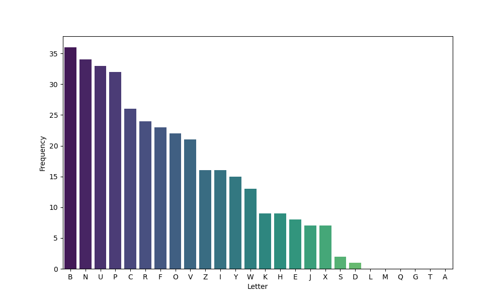
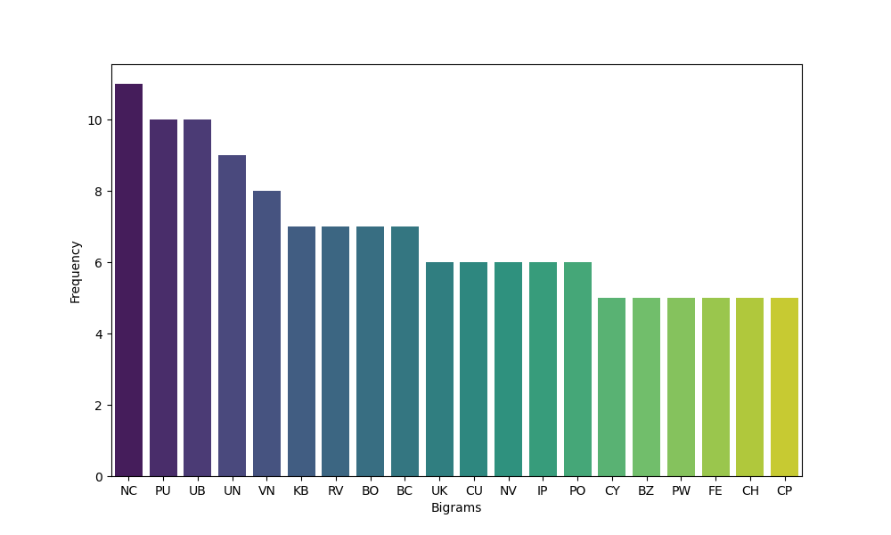
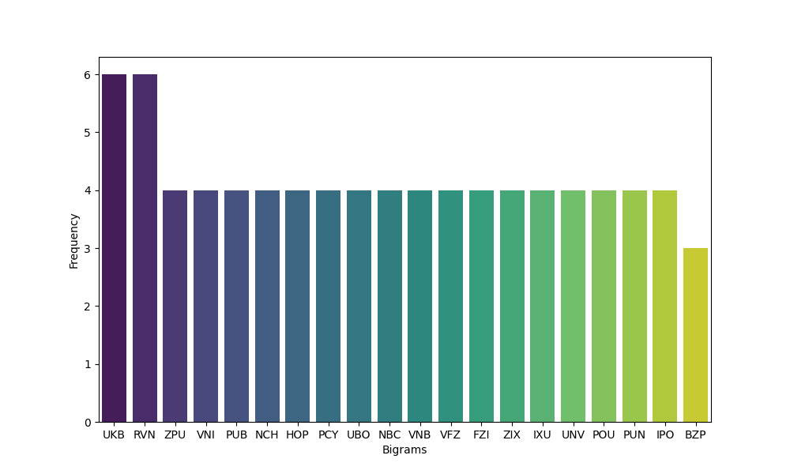

### What is Cryptography?
**"Cryptography is the practice and study of techniques for secure communication in the presence of adversarial behaviour - (Wikipedia)"** This techniques ensure that Alice can send a message to Bob without Eve compromising the confidentiality.

Today, cryptography is wherever there is technology. That means it's everywhere.

<br>

### Applications
1. **Secure Communication** - The core of cryptography is to ensure two parties can communicate securely. Cryptography achieves this by securing web traffic with protocols like SSL(Secure Sockets Layer) and TLS(Transport Layer Security) to ensure that sent messages can only be read by the intended receipient. Traffic in Wireless networks is also protected using the WPA2(Wifi-Protected Access 2). Same applies to cellular traffic an bluetooth. 
2. **File Encryption** - crptography is used to encrypt files on disk. This ensures that even when the disk is stolen, confidentiality is not compromised. 
3. **Digital Rights Management** - copy protections on DVDs uses cryptographic algoriths that we'll study later.
4. **User Authentication** - Cryptographic algorithms are used to hash users passwords so that when the database is compromised the hashes cannot infer the plaitext passwords.
5. **Digital Signatures** - in the physical world we use handwriten signatutes to proove identity and consent in documents. Signatures provide evidence that some message originated from you or you clearly agrreed to something. In the digital world, it's hard to use the same handwritten signatures because once an adversary has access to one of your signed documents, they could copy and paste to other documents you need to sign. Cryptography solves this problem of ditally signing by ensuring that your signature is always a function of the content being signed. This protects using the same signatute in a diferent document.
6. **Cryptocurrencies** - cryptography is the foundation of anonymous digital cash like Bitcoin and Etherium. It offers the way for transactions to be verified without a trusted third party and also prevent double spending.

<br>

### Terminologies
- Plaintext - the message in clear text that is to be transmitted.
- Ciphertext - the scrambled version of the message after being encrypted.
- Cipher - the encryption algorithm used.
- Keyspace - a set of possible keys that can be used.

<br>

### The History of Cryptography
Cryptography dates back to the 19th centuary and 'it's developement has been paralleled by cryptanalysis - the art of code breaking' and the need for secure communication during the world wars. It has evolved from simple substitution ciphers to more mordern algorithms laid on mathematical ideas. 

**a.) Substitution Cipher** - this is a method of encrypting messages by eplacing letters in the plaintext with a random defined letter in the substitution alphabet. One earliest example of a substitution cipher was the `ceasar cipher`. Devised by Julias Ceasar, this algorithm encrypts a message by replacing the plaintext letters with another letter some fixed number of positions forward/backward; that is if the message is encypted with a shift of 3 forward(shift of 23 backward) - A becomes D, B becomes E...   
   
The key in this algorithm in the number of shifts. For example the message **`ATTACK AT SUNRISE`** encypted with a shift of 3 forward becomes `DWWDFN DW VXQULVH`. Decrypting a ceasar cipher reverses the method, a forward shift is decrypted by a backward shift and vice versa.
Ceasar cipher is so easy to break because of its small keyspace(26 for english alphabet). This is very easy to bruteforce. Let's crack it with a bruteforce script.   

```python
    CIPHERTEXT = "DWWDFN DW VXQULVH"
    KEYSPACE = 26

    def bruteforce(ciphertext):
        for key in range(KEYSPACE):
            if key == 0:
                continue
            p_text = ''
            for i in ciphertext:
                c_val = ord(i)
                if c_val == 32:
                    p_text += ' '
                    continue
                p_val = c_val - key
                if p_val < 65:
                    p_val += 26
                p_text += chr(p_val)
            print(f'Key {key} -> {p_text}')
    bruteforce(CIPHERTEXT)
```
**ROT13** is another classical example of ceasar cipher with a shift of 13.  
  

The Keyspace for a random substitution cipher utilizing letters in the english alphabet is 26!(number of permutations of all 26 letters). This is nearly 2<sup>88</sup>. However, substitution ciphers can still be brocken using a technique _frequency analysis_. 
**_Frequency analysis_** uses variation in the occurences of letters of the alphabet in text to crack ciphers. For example, the most common letter in the english alphabet is e, appearing more than 80%. Therefore, if the most appearing letter in the ciphertext is say W, this would be likely the substitute for e. Z has the least occurence making it a substitute to the least occuring letter.

```chart
{
  "type": "bar",
  "data": {
    "datasets": [
      {
        "data": [
        8.17, 
        1.49, 
        2.78, 
        4.25, 
        12.70, 
        2.23, 
        2.02, 
        6.09, 
        6.97, 
        0.15, 
        0.77, 
        4.03, 
        2.41, 
        6.75, 
        7.51, 
        1.93, 
        0.10, 
        5.99, 
        6.33, 
        9.06, 
        2.76, 
        0.98, 
        2.36, 
        0.15, 
        1.97, 
        0.07
        ],
        "backgroundColor": "#19fd07",
        "label": "Frequency Analysis of the English Alphabets"
      }
    ],
    "labels": [
        "A", 
        "B", 
        "C", 
        "D", 
        "E", 
        "F", 
        "G", 
        "H", 
        "I", 
        "J", 
        "K", 
        "L", 
        "M", 
        "N", 
        "O", 
        "P", 
        "Q", 
        "R", 
        "S", 
        "T", 
        "U", 
        "V", 
        "W", 
        "X", 
        "Y", 
        "Z"
    ]
  },
  "options": {}
}
```
<br>

Imagine that we have intercepted this scrambled message.
```UKBYBIPOUZBCUFEEBORUKBYBHOBBRFESPVKBWFOFERVNBCVBZPRUBOFERVNBCVBPCYYFVUFOFEIKNWFRFIKJNUPWRFIPOUNVNIPUBRNCUKBEFWWFDNCHXCYBOHOPYXPUBNCUBOYNRVNIWNCPOJIOFHOPZRVFZIXUBORJRUBZRBCHNCBBONCHRJZSFWNVRJRUBZRPCYZPUKBZPUNVPWPCYVFZIXUPUNFCPWRVNBCVBRPYYNUNFCPWWJUKBYBIPOUZBCUIPOUNVNIPUBRNCHOPYXPUBNCUBOYNRVNIWNCPOJIOFHOPZRNCRVNBCUNENVVFZIXUNCHPCYVFZIXUPUNFCPWZPUKBZPUNVR```
Say we know that the original message was writen in english. Let's decipher it. The first step is to perform a frequency analysis of the letters. We could also perform frequency of pair of letters(digrams, trigrams...) wih this we can identify pairs line 'THE', ARE', 'ON', 'AT'...etc.



It's evident that 'B' is the most frequent letter in the ciphertext. Let's assume its the substitute for 'E'. 'N' and 'U' are the next appearing letters. They could represent substitutes for 'A' and 'T'. Let's perform frequency analysis of 2 pairs and seee what's most common. 



We notice that 'NC' is the most common. Therefore i could stand for 'IN', 'OF', 'BY', 'DO, 'IF'...etc.
Let's look at thre most frequent trigram. 



Well, we have 'UKB'. Assuming we were right with our choice of 'B' as a substitute of "E". It's fair to also asumme that 'U' is a substitute of 'T' and the trigram 'UKB' is a substitute of 'THE'.