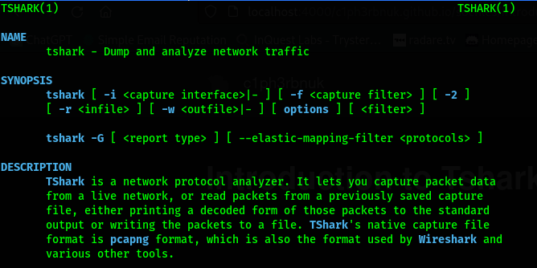  

Last time we covered the practical tips of Wireshark, a Graphical User Interface(GUI) tool for anayzing network packets. We enjoyed it's powerful and very user-friendly interface where we could just click buttons to utilize it's features. Well, sometimes as SOC analysts we may need to perform network analysis on headless servers and remote enviroments where we lack the ability to operate with GUI-based tools. Othertimes we may want to automate our analysis by writing scripts and utilize other tools in our OS to aid in analysis. And for most times, we may want to run our monitoring for a very long time and it would be fair if we could have a tool with similar abilities as wireshark that can run in the background for as long as we need.
 

Developed by Wireshark, Tshark offers a commandline alternative for Wireshark. It's designed to be lightweight; consumes less resources and offers additional ability to use the commandline pipe and pass results to other tools. Just like Wireshark T-shark can capture packets, filter and even generte network traffic statistics.

### Instalation
If you installed Wireshark in windows, open the commandline and navigate to the Wireshark directory. From there you can run tshark. For Linux distributions use `sudo apt get install tshark`.

### Tshark Options
To explore the available Tshark options use `tshark -h`.  

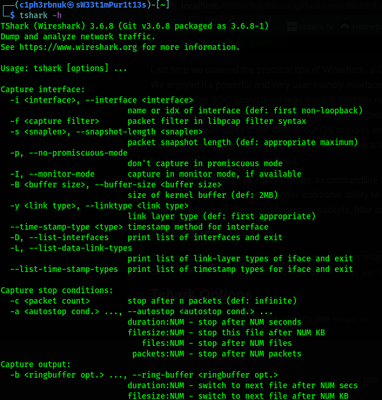

1. **-v** - prints the version of Tshark.  
`tshark -D` lists all the interfaces available for capture.  
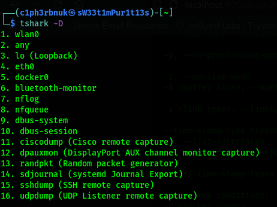   
2. To capture traffic on a specific interface, you specify the interface using the **-i** option followed by it's ID or name e.g `tshark -i 1` or `tshark -i wlan0`. We may need to generate some traffic before we start seeing packets flow. I'll ping the google DNS server.
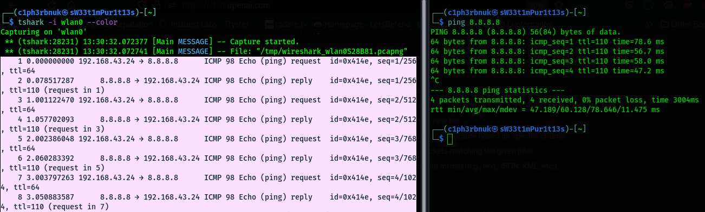
Appending the `--color` option, lets you colorizes the traffic.  
3. To capture exact amount of packets we use the **-c** option for count. Tshark will stop capture after the packet count is reached.  
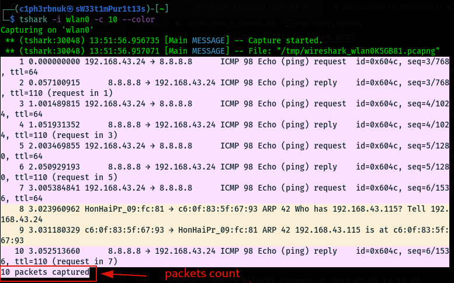

4. The **Verbose Mode** specified by the **-V** option shows us more details about each packet. It's similar to the **Packet details** pane in wireshark.

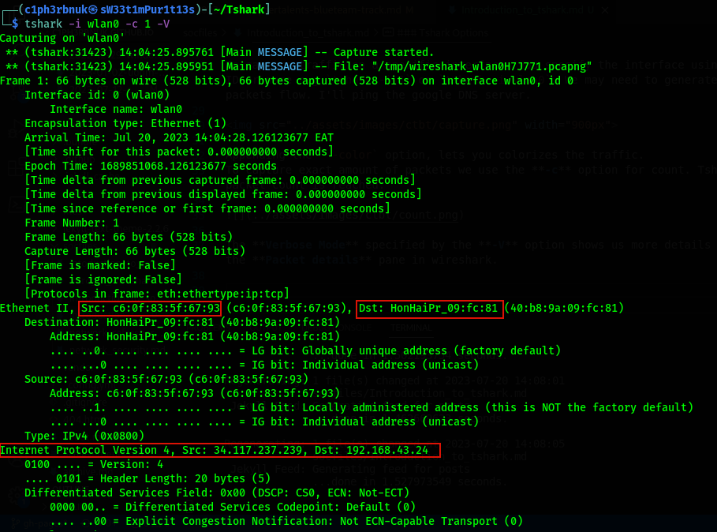
#### Capture Filters
Capture filters selectively include or excludes packets based on the specified criteria. In Tshark, capture filters are specified using the **-f** option. It uses similar filters like the ones we discussed in wireshark e.g by port `tcp port 80`. Checkout this [cheat-sheet](../files/Wireshark%20Cheat%20Sheet-1.pdf)
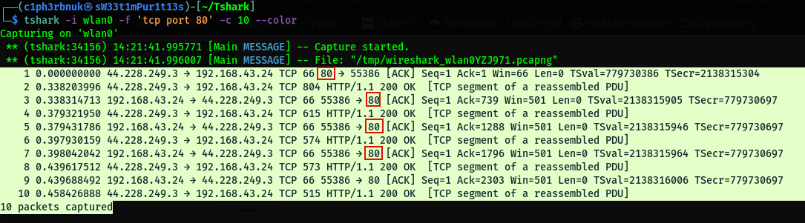

#### Writing to a file
Rather than displaying packets on the console, Tshark has the ability to write captured packets to a file when the **-w** option is specified. This option takes the file name.  
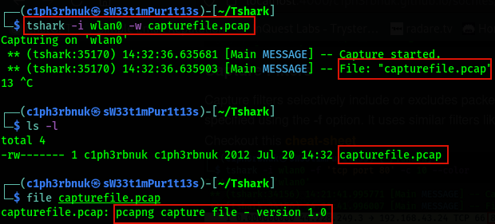  

#### Writing to Multiple files
We can also split captures to multiple files using the **-b** option for buffer. Splitting may be based on:   
- filesize: switch to the next file after the given size limit(KB).
- files: maximum number of files.
- duration: split after a number of seconds.   
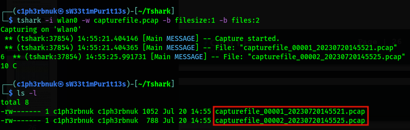  

Also note that the file number and a timestamp are added to the filename.

### Reading from a file
The **-r** option reads packets from a specified capture file (PCAP or PCAPNG format).  
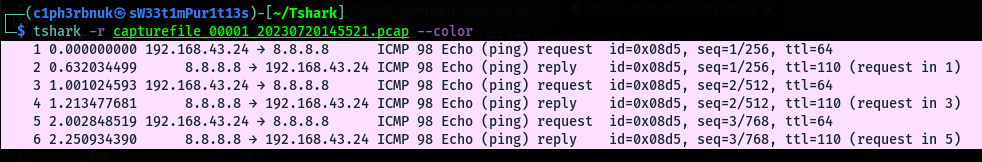

To apply display filters use the **-Y** option. Display filters are the same as used in wireshark. Check cheat sheet above e.g `dns, tcp, ip.address==10.1.1.2`  
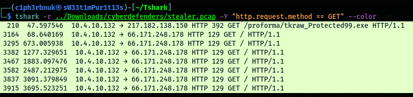  

### Output formats
There are  different output formats available to display packets details(e.g text, json, pdml). Output formats are specified using the **-T** option.  
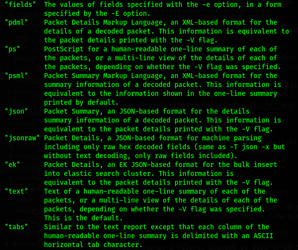  

Let's try tabs! 

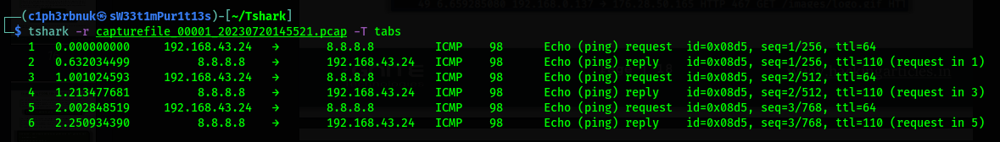

### Statistics
Just like wireshark, Tshark too offer network statistics like conversations statistics, endpoint statistics, protocol hierarchy statistics and even packet lengths statistics. Statistics options are availble with the **-z** option.  
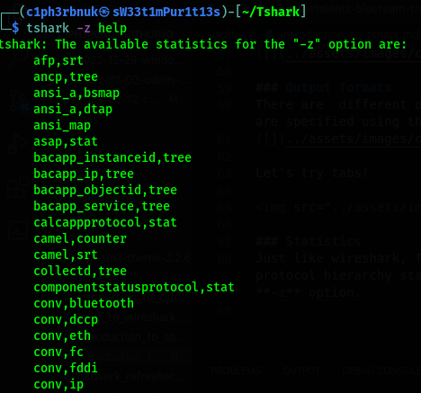  

### Protocol Hierarchy stats(PHS)
PHS displays a distribution of protocols in the capture. Using the option **-z** followed by **io,phs** we can summarize a trace file by a breakdown of protocols.   
`tshark -r packetcapture.pcap -z io,phs`   
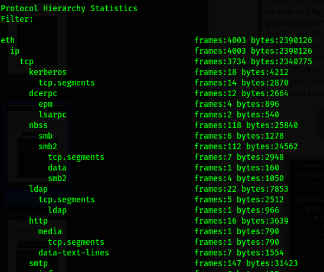  

### Packet Lengths statistics
These statistics provide insights into the distribution of packet lengths in the network traffic. It helps identify anomalies, such as unusually large packets.  
`tshark -r packetcapture.pcap -z io,pls`   
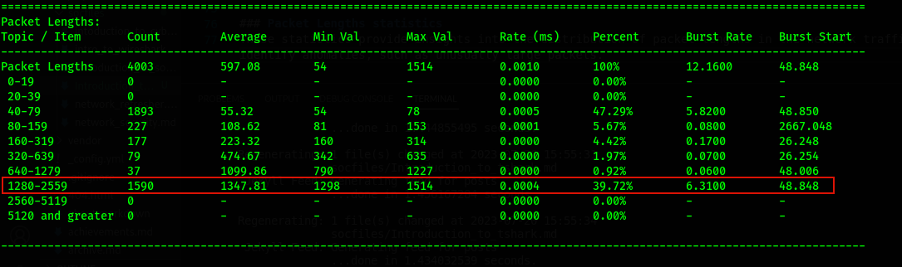

We also have the ability to look at specific protocol tree distribution. For example if we consider HTTP requests, we get an analysis of the Status codes distributions.
`tshark -r packetcapture.pcap -z http,tree`  

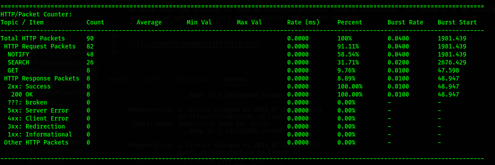

**Try to explore more on conversations and endpoints!!** For a detailed guide on Tshark, check this book by Hacking Articles [Tshark Guide](../files/tshark.pdf).

 

### Challenge Time!
We will be solving a challenge called **Creepy DNS** from CyberTalents. I'm not allowed to share flags, so i'll just demonstrate the process but hide the flag.

**Challenge Description**: `Our NMS detect a suspected traffic, your task is to investigate the captured traffic and find the anomaly reason`.  
**File**: `dns.pcap`.

From the challenge, let's filter DNS traffic and see what's so creepy about it. :stuck_out_tongue_winking_eye: 

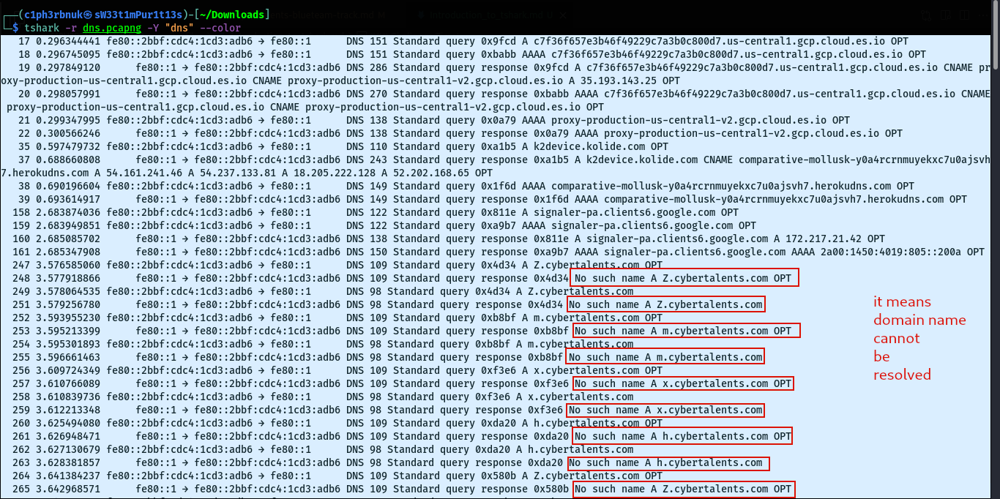

When a DNS client such as a web browser attempts to resolve a domain name into an IP address, it sends a DNS query to a DNS server. If the DNS server cannot find a matching IP address for the requested domain name in its records, it responds with a "No such name" DNS response.

We can note alot of "No such name" responses for different subdomains of **cybertalents.com**. A subdomain is basically a part of a larger domain that helps group and organize services e.g A company with a domain name like `mycompany.com` may wish to separate it's email services to a smaller group called `mail.mycompany.com`. The traffic above tells us that someone tried to access subdomain names that don't exist. If we look closely we can see single characters subdomains(Z, m, x....) that flow downloads, most of them are repeated. Could these characters together mean anything useful? Let's find out.

We will use the grep tool in linux that uses regular expressions to return pattern match.

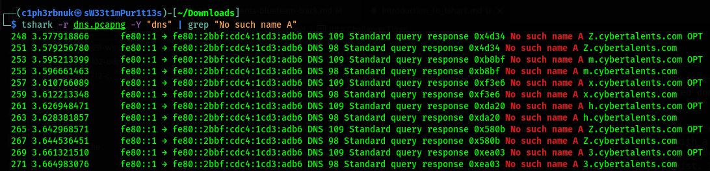

We'll deal with the repeated strings later, let's first extract just the field with the subdomains. We'll use another tool called cut by piping the output forward. This tool extracts speficic fields characters separated by a delimeter. Our delimeter is space, and i counted the field number to be 23.

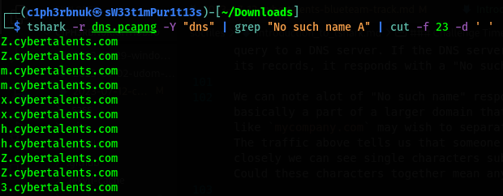  

How about we now remove the duplicates. The **uniq** command will do that then, we'll extract just the first character using the **cut** command but this time with **-c** option.

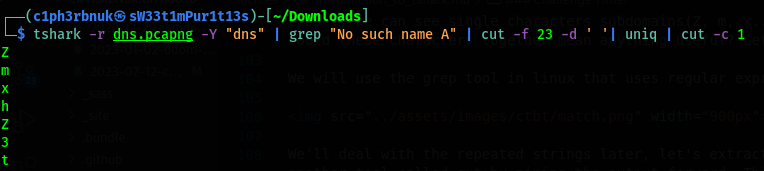  

That's what we needed. But, can we just remove the newlines and have a contious string? The **tr** command is used for transformation. Let's use it to delete the new lines. 

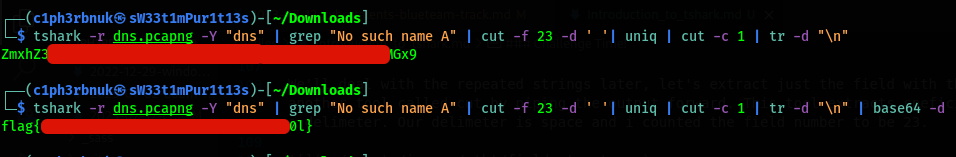

Our string is base64 encoded. If we decode that, we get our flag! :open_mouth:

 

Network analysis tools are many(Network minner, tcp dump, scapy...), we won't discuss all of them. Their workings are almost simmilar. This article wraps up our discussion on network security. Network security is a wide topic, suffice to say, a whole course by itself! We just reviewed some important sections that are handy for SOC analysts. 

Next time well uncover **Endpoint Security**, yet another layer in our "defense in depth"! We will learn about the technologies that are there to protect our host devices like Antiviruses and Host based fiwerwalls!

I'd love to hear your comments and constructive critiques about this series! 

See you in the world of Endpoint Security! :smiley:

