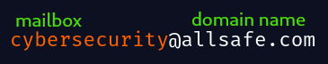
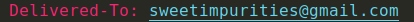
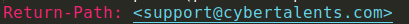
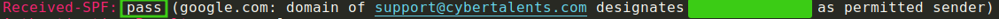
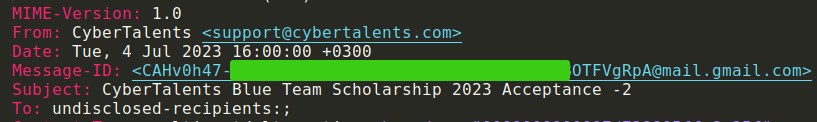

  

**Why bother break into a system while owners can willingly give you the password?**

Email-based phishing has emerged the most porpular social engineering technique used by cyber criminals to harvest users credentials and distribute malicious payloads. Utilizing fear, urgency, and curiosity in emails has become the favored approach for cybercriminals to entice more users into clicking on malicious links or downloading attached malware. 
Today, we are going to learn how emails work. 

### Structure  

### Protocols
The following are the 3 primary protocols used in email communication:

1. **Simple Mail Transfer Protocol(SMTP)** - SMTP operates on port 25 and is responsible for the transmission of outgoing emails. When a user sends an email, the email client(gmail,outlook..) uses this protocol to send the email to the recipient mail address.
 

2. **Post Office Protocol 3(POP3)** - POP3 is an email retrieval protocol used by mail clients to retrieve emails from a mail server. It operates on port 110. Once the email client downloads the email from the mail server, the email is deleted from the mail server. No other device can access it. Emails can only be accessed by the first device that downloaded it. This protocol is not so efffective when you need synchronization of messages in your mail box across multiple devices(tablet,laptop, smartphone).
 

3. **Internet Mail Access Protocol(IMAP)** - IMAP is another email retrieval protocol that allows users to access emails from multiple devices while keeping the emails synchronized across all devices. When you access your email using IMAP, the server retains your emails, and any changes you make (read, delete, move) are synchronized across all your devices. IMAP operates on port 143.
 

### Email Authentication Protocols
The email authentication protocols are mechanisms set to to help prevent email spoofing, phishing and other email-based threats. They work together to verify the integrity and authenticity of emails.

a.) **Sender Policy Framework(SPF)** - this protocol allows the owner of a domain to specify which mail servers are authorized to send emails. ["Spammers can forge your domain or organization to send fake messages that appear to come from your organization. This is called spoofing. Spoofed messages can be used for malicious purposes. For example spoofed messages can spread false information, send harmful software, or trick people into giving out sensitive information. SPF lets receiving servers verify that the mail that appears to come from your domain is authentic, and not forged or spoofed" - Google](https://support.google.com/a/topic/9061731?hl=en&ref_topic=9202&sjid=11035340277079725506-EU). For example the SPF record below specifies that the domain `mail.allsafe.com` is allowed to send emails on behalf of `allsafe.com` . 
  
When an email is received the recipient's mail server can check the SPF record of the sender's domain. If the sending mail server's IP address matches one of the authorized servers listed in the SPF record, the email passes the SPF check otherwise it fails. Based on the result of the SPF check the following actions may be taken:   
- pass - SPF check is successful; the mail server is authorized to send emails.
- None - No SPF record was found.
- Neutral - The SPF record doesn't explicitly authorize or reject the email.
- Soft fail (~ all) - SPF check failed(suspicious). The mail may be sent to spam/completely rejected based on the DMARC policy set(See DMARC below)
- Hard Fail (- all) - The email should be rejected because the mail server is not authorized to send emails for the domain.

b.) **Domain Keys Identified Mails(DKIM)** - this is a cryptographic authentication method that allows the receiver to verify the integrity and authenticity of the email's content through digital signatures. The sending mail server signs the email with a private key, and the recipient's mail server uses the corresponding public key advertised in the domains' DNS records to verify that the emai's content has not be tampered with during transmission.

c.) **Domain-based Message Authentication, Reporting and Conformance(DMARC)** - allows domain owners to define policies for handling emails that fail SPF and DKIM checks. How should the recipient server treat emails that failed the authentic check? DMARC policies include:   
- None - Take no action on failed authentication. Monitor and observe.
- Quarantine - Treat emails that failed authentication as suspicious and store them in Spam folder to prevent the recipient from falling into a potential phishing attempt.
- Reject - DO NOT DELIVER all emails that fail authenticity check.

To learn mor about these methods of authentication please refer to [Email authentication: How SPF, DKIM and DMARC work together - by Peter Loshin](https://www.techtarget.com/searchsecurity/answer/Email-authentication-How-SPF-DKIM-and-DMARC-work-together).

 

### Email Headers
The email headers section of an email message contains the metadata(data about data) of the email(like origin, destination, date, etc..).
- Delivered-To - indicates the receipient email address.    

 

- Return path - Also known as the bounce address, it specifies where the email should be sent incase it is not delivered.

 

- Received-SPF - added by the recipient's mail server to the email's header to record the result of the SPF check(pass, fail, soft-fail).  

- From - dsplays the senders address. It can easly be forged and should not be trusted.
- To - displays the name of the receiver.
- Date - displays the date and time when the email was sent.
- Subject - displays the Subject of the email.
- Message-ID - a unique identifier of the particular email assigned by the senders mail server.
- Content-type - specifies the format of the email body(plaintext, xml, HTML)
- MIME-Version - the Multipurpose Internet Mail Extensions (MIME) version used in the email. MIME extends the capabilities of email messages to support various types of content beyond plaintext(attachments, images).  

 

- X-Headers - allow senders to include additional information in email headers beyond the standard headers. For example, X-Mailer shows the email client used to send the email, X-Antivirus states the senders anti-virus programme. 

 

It's essential for us SOC analysts to understand the anatomy of emails inorder to better identify suspicious emails. Next time we'll dive into Email header analysis. The Email headers contains valuable information about the email. These header properties values may help us identify perhaps signs of spoofing like when the **FROM** value differs from the senders domain. We'll also analyze the email body verifying all attachments and links and diserning subtle cues of deceit and maliciousness. 

Let's keep doing what we know how to do best; learnig how fortify our cyber defenses. Se ya! :smiley: