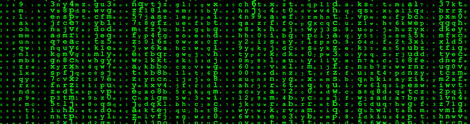
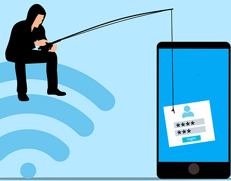
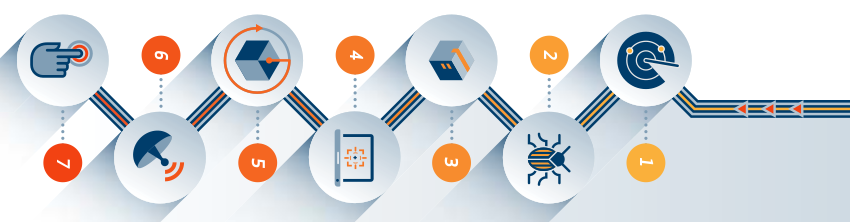
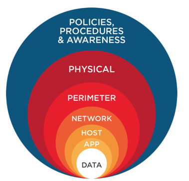

At its core, cybersecurity involves protecting computer systems, networks, data, and information from unauthorized access, theft, damage, or disruption. It encompases wide range of measures, processes, strategies, technologies and practices that are set to ensure the confidentiality(only for authorised individuals), integrity(prevent unauthorised modifications) and availability(ensures accessibility all times) of digital assets. 
 

### Terminologies 
* Vulnerability -- This is a weakness or a flow in a system that can be exploited by malicious actors. A vulnerability can be due to logic flaws, misconfigurations or even outdated softwares.  
* Exploitation - Taking advantage of a vulnerability to gain access to a computer system.  
* Zero day vulnerability - this is a software vulnerability that is unknown to the software developer. It is called zero day because it is exploited before any patches or fixes are available.  
* CVE(Common Vulneranility Exposures) - this is a database of publicly disclosed information security issues, also CVE standard name for a unique ID which can be used to track publicly known software vulnerabilities and exposures.

 
### Cyber Attacks  
A cyber attack refers to a malicious attempt to gain unauthorised access to Computer Systems, Infrastructure and Networks. Depending on the goals and capabilities of the attackers, cyber attacks can be of different forms. Some common cyber attacks include:

* Phishing - This is a type of Social Engineering attack where the attacker poses a legitimate source to trick victims into revealing their sensitive data like passwords and credit card details or to deploy malicious code in their devices. Phising can be of many types including email phishing, vishing(through telephone), smishing(via text/sms) etc.. 

* Denial of Service(DOS)/Distributed Denial of Service(DDOS) - these attacks are meant to overwhelm targeted systems with traffic rendering them unavailable to other users.  
* Malware attacks - type of attacks that deploys malicious code such as viruses, worms and ransomware to encrypt, steal or disrupt systems operations.
*  Man in the Middle attacks - here the attacker intercepts commmunication between two parties therefore being able to eavesdropp or steal infomation.  
* Insider threats - these attacks are as a result of individuals with legitimate authorised access to company's assets like employees who intentionally compromise systems and networks.

 
### The Cyber Kill Chain

Developed by Lockheed Martin, **The Cyber Kill Chain** is framework widely used in cyber security to describe the stages that threat actors must go through to conduct a successful cyber attack. This model consist of 7 stages starting right from the initial reconnaissance phase down to the attacker's final objectives. It helps organizations and security proffessionals understand the different phases of an attack.
 

1. **Recon(Reconnaissance)** - also known as information gathering it is the first stage where the attacker gathers infomation about the target system/organization. Depending on whether it's passive or active recon, this may include hunting for employees emails on the internet or probing for open ports and services on systems to identify potential vulnerabities. 

2. **Weaponization** - once the attacker has gathered required information, they obtain tools(weaponizer) or create specific exploits for the target vulnerabilities in the system. 

3. **Delivery** - this is where the attacker lauches the attack. Armed with the malicious payload the attacker may choose to deliver it through phishing email, links or through a malicious USB drive. 

4. **Exploitation** - In order to gaina access to a system, the attacker must exploit an existing vulnerability in the system. At this stage, the attacker takes advantage of that weakness. It could be weak passwords or outdated softwares.  

5. **Installation** - this is where the attacker establishes foothhold by installing backdoors in order to create persistent access to the victim machine. With this, the attacker maintains control over the compromised system.

6. **Command and control(C2)** - Here, the attacker opens communication channels with the victim machine allowing full remote control and send commands...Full manipulation of the victim. 

7. **Actions on objectives** - This is the final stage where the attacker achieves what he came in to do; steal data, encrypt, destroy systems, moving through the enviroment...etc 

 

### Defense in depth
Defense in depth is a cyber security strategy that involves implementing multiple layers of security control to protect organization's assets. The goal is to increase overal security of an organization assets.
  

Let's start inside with our data.
1. Data Security - this layer focuses on securing organization's data at rest and in transist through encryptions to prevent unauthorised access, hashing to infer integrity and DLP(Data Loss Prevention) solutions to monitor and prevent the use of sensitive data.

2. Application security - AppSec deals strategies for securing our software applications to protect against application-level attacks such as SQL-injections and Cross-site scripting attacks. We conduct vulnerability testing to identify and fix vulnerbilities. Also perfoming secure code reviews.

3. Host/Endpoint security - to protect out host systems from attacks we configure host based firewalls and deploy endpoint security products like firewalls which help detect and shut down malicious programs.

4. Network Security - to safegurd our network from threats we may use VLANs segmentations to divide our network broadcast domains and aloso use tools like Intrusion detecction systems and Intrusion prevention systems.

5. Perimeter Security - perimeter security deals with security at the boundary of our network. Firewalls helps filter inbound and outbound traffic for anomallies. VPNs also are deployes to enble secure communications between remote employees or business partners and branch offices.

6. Physical security - this is an essential layer to protect physical assets from damage. Employing security gurds, instaling CCTVs and setting up gates and fenses to deter unauthorised entry.

7. Policies and User Awareness - Lastly, the most important is training and educating users and employees about cyber security best practices.  

 

**"CYBER SECURITY IS NO LONGER A CHOICE BUT AN IMPERATIVE IN OUR INTERCONNECTED WORLD!"**

 
That's all for today! Next time we'll introduce what SOC is, it's benefits and why we need it! See ya!:relaxed: