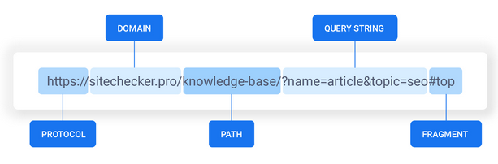
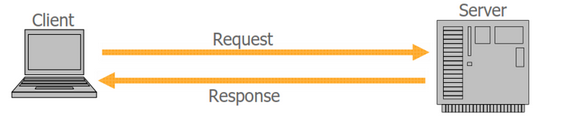
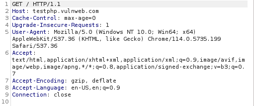
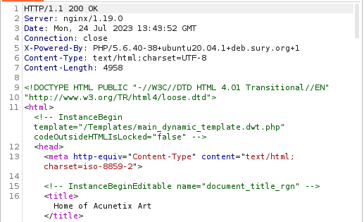
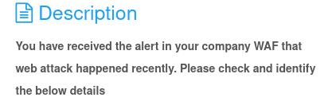
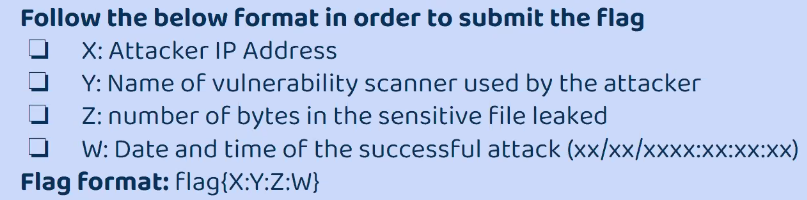
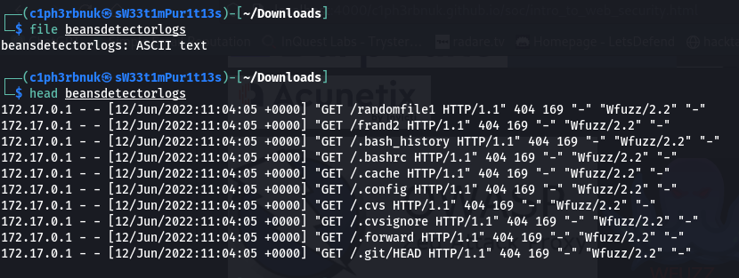
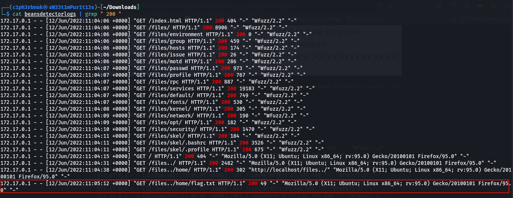

According to the [2023 Verizon Data Breach Investigations Report (DBIR)](https://www.verizon.com/), Web application attacks account to approximately 25% of the total breaches in today's threat landscape. Web applications have become the primary way for organizations to interact with customers from E-commerce, Marketing to Financial transactions and Healthcare services. It's vital for SOC analysts to understand web attacks to effectively detect them. Today we'll go through the common web attacks; our main focus will not be about exploring the different hacktricks to exploit them but rather the defense against them.

### Uniform Resource Locator(URL)
A URL is a unique identifier of a web resource through which that recource can be retrieved[The Web application Hackers Handbook]. It's basically just a way to specify where a particular resource(image,file etc) is. URL's follow the following format:  
**protocol://domain_name:port/path_to_file/?query=value#fragment**
- **protocol** - https,https,ftp....
- **domain-name** - the server where the resource is located e.g google.com, netflix.com
- **port** - this one is optional incase an application doesn't use the default port(http,https = 80,443)
- **path** - location on the server where a specific resource is located.(/images/latest/)
- **query** - used to pass data to the server when making a request. Goes after the **?**. Takes the **key=value** form.(?size=small)
- **fragment** - identifies a specific section withing the resource   

### How web works!
The world wide web uses the HTTP protocol to communicate. This protocol facilitates data exchange between a client and a server in form of requests and responses. When a user types in a URL in the web browser, the browser initiates an HTTP request to the web server which then replies with an HTTP response.  

### HTTP Requests
HTTP requests are stateless, meaning the server does not maintain any sessions. Once a request is made to the server and a response is received the connection is closed and the next request is treated as an independent request.
The first line of every HTTP request contains a verb (indicating HTTP method), the requested URL and the HTTP version.  

#### HTTP Methods
- **GET** - used to retrieve resources
- **POST** - used to submit data (login credentials, form data...)
- **PUT** - used to update an existing resource. The server replaces the current resource with the new one.
- **DELETE** - used to remove specified resource
- **HEAD** - same as GET but the server response does not contain the body.
- **TRACE** - used for diagnostics purposes.
- **OPTIONS** - used to view the HTTP methods that can be used for a particular resource.

 

#### Some HTTP Request Headers
- **Host** -specifies the Host name
- **Accept** - specifies the kind of content the client is willing to accept.
- **Accept-Encoding** - specifies the ype content encoding the client is willing to accept
- **User Agent** - provides information about the browser or other client soft-
ware that generated the request.
- **Referer** - specifies the URL from which the current request originated.

For more on HTTP headers please check out this article [More on Headers](https://developer.mozilla.org/en-US/docs/Web/HTTP/Headers).

 

### HTTP Responses
The first line of any http response contains the HTTP version, a status code and a phrase describing the status(OK,NOT FOUND....). HTTP responce headers follow then the body.  

#### Some HTTP Response headers
- **Server** - provide info about the web server being used.
- **Content-Type** - specifies the type of the content in the response body.
- **Content-Length** - species the length in bytes of the body.
- **Connection** - specifies whether the TCP connection should be closed after the transmission is complete.
- **Location** - used in redirection responses to specify the target of the redirect.

#### Status Codes
Status codes indicate the result os the request. They fall into 5 classes based on the first digit of the code.
- **1xx** - Informational - the client should continue with the request.
- **2xx** - Successful - the client’s request was successfully received, understood, and accepted.(200 OK, 201 CREATED)
- **3xx** - Redirection - indicate that the requested resource is temporarily or permanently moved to a different location.
- **4xx** - client error such as resource not being found, client not allowed to access the resource or authentication is required.
- **5xx** - Server error - The server is aware that it has erred or is incapable of performing the request.

For more on HTTP response status codes, please check out this article [Response status codes](https://developer.mozilla.org/en-US/docs/Web/HTTP/Status).

As a SOC analysts, the status codes can be very insightful in detecting potential attacks. If you encounter a large number of 404(Not Found) errors, it could be a sign of directory enumeration. Frequent 401 (Unauthorized) responses may indicate access attempts or failed authentication attacks(Login bruteforce attacks). Unusually high occurrences of 503 (Service Unavailable) status codes may indicate a DoS or DDoS attack targeting the server's resources.

 

### [OWASP TOP 10](https://owasp.org/www-project-top-ten/)
The Open Web Application Security Project (OWASP) Top 10 is a document that lists the ten most critical web pplication security risks. It's updated every 5 years with new critical vulnerabilities.

1. **Brocken Access Control** - this vulnerability occurs when authorization is broken. This offers unauthorized users permissions to access sensitive information that they shouldn't(e.g Being able to acces other users data).
2. **Cryptographic Failures** - this vulnerability occurs when cryptographic mechanisms are improperly implemented or use of weak algorithms(use of isecure hases like MD5 algorithm).
3. **Injection** - injection vulnerability occur when there is no validation of the inputs users type. This opens up for malicious actors to inject malicious code or commands and execute them leading to unauthorized access(SQL injection, Code Injection).
4. **Insecure Design** - this vulnerability arises from the logical design of the application. Attackers could bypass the logic and gain unauthorised access.
5. **Security Misconfiguration** - occurs when applications and servers are not properly configured to achieve security(leaving default passwords, exposing unneccessary open ports).
6. **Vulnerable and outdated components** - this arises when an application uses outdated softwares, packages and dependencies that my nolonger be supported by the developer. This makes them risky and vulnerable.
7. **Identification and Authentication Failures** - this comes with weak authentication(verifying users that they are who they say they are) e.g Weak passwords that could easily be brute-forced.
8. **Software and Data integrity failures** - When an application relies upon plugins, libraries, or modules from untrusted sources it poses a risk to the application. The whole company's software could be built on a malicious code.
9. **Security Logging and Monitoring failures** - without logging and monitoring it becomes a challenge to identify and respond to threats in real time.
10. **Server Side Request Forgery** - SSRF flaws occur whenever a web application is fetching a remote resource without validating the user-supplied URL[owasp]. Say an application allows users to input a reference link to an image to be used as their profile photo rather than uploading. An attacker could misuse this and reference say `https://127.0.0.1` which enables them to access the server from it's localhost.

 

**Web Application Firewalls(WAF)** is the technology devised to protect web applications from these threats. It monitors all the incoming requests and only allow the legitimate ones. WAFs also generate web traffic logs for both allowed and denied requests. These logs are a great source for incident investigations. 

**Web Application Scanners**
A web application scanner is a software tool that is designed to crawl websites and identify vulnerabilities in web applications. Here's a list of the most common ones in the industry [Web scanners](https://owasp.org/www-community/Vulnerability_Scanning_Tools).
  

 

### Challenge Time!
We'll be solving [ **beansdetector** ](https://hubchallenges.s3.eu-west-1.amazonaws.com/foren/beansdetectorlogs) challenge from cybertalents.      

The file is a log file fron a WAF. If we look at the first few lines, just like most logs it follows a pattern: `IP ADDRESS, DATE, HTTP_METHOD, FILE_REQUESTED, HTTP_VERSION, RESPONSE_BYTES, WEB_SCANNER`  

There are alot of 404 status codes which indicate directory enumeration. The attacker was trying to discover all pages, files and directories that can be accessible from the web application. For successful attacks we must investigate the successful requests with status code 200 OK.

The attacker was able to discover some few files withing the web application and the last record below shows us an interesting file that was exposed. Use the flag format above to construct the answer! 

 

That's all for our introduction to web application security. Next time we'll focus on the attacks, showcase some exploit examples and how to mitigate them! See you next time!:smiley: