  
**Wireshark** is a powerful, open-source network analysis tool that allow users to capture and inspect network traffic[cybersecuritynews]. Wireshark allow users to see all communications between devices happening within a network. Wireshark can be used as a tool to sniff sensitive data like passwords flowing across a network. As SOC analysts, we'll use wireshark for forensics purposes. For most times it will be our go-for tool for analyzing saved network traffic(trace files) and investigate suspicious activities.

Download and install Wireshark [Here](https://www.wireshark.org/) to follow along with me.

### Getting Started with Wireshark
To start seeing packets flowing we'll need to perform a packet capture. This involves choosing from a list of network interfaces we have then click start. 
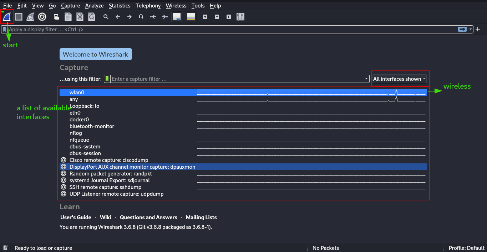
Once you click start, wireshark will be filled with alot of packets depending on how busy the network is.

#### Wireshark's Main Windows
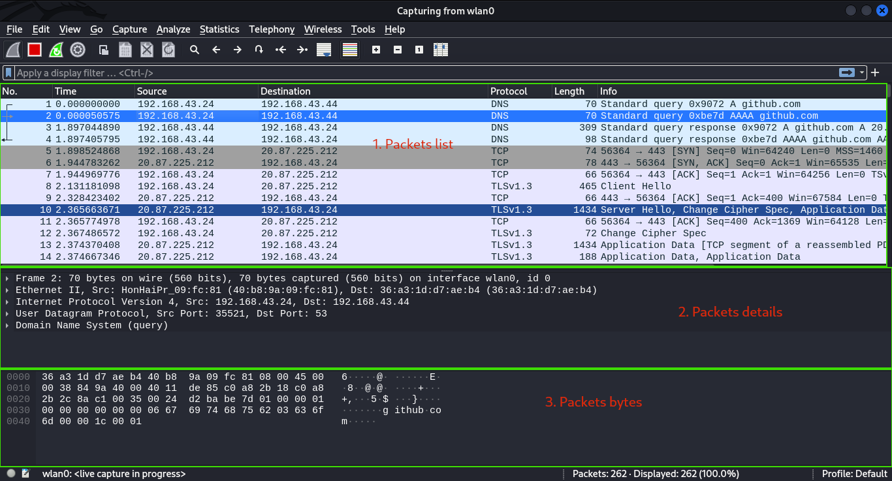
There are 3 panes in the wireshark's main window; packet list, packet details and packet bytes.  

1. **Packet List** - The packet listing pane displays a list of captured packets with various details, such as the packet number, time, source and destination addresses, protocol, and packet length.
2. **Packet Details** - When you select a packet from the packet listing, the packet details pane shows the specific contents of the selected packet in hierachical form that can be expanded further. 
3. **Packet bytes** - The packet bytes pane displays the raw hexadecimal representation of the selected packet, allowing users to see the actual bytes of the packet.

 

Apart from the panes we have a **Menu bar** at the top which contains various menus(e.g File, Edit, Analyze, Statistics..). These menus provide access to different functionalities. For example when we go to **Statistics > Protocol Hierarchy**, we able to view the distribution of traffic by protocol. What percent is TCP traffic and UDP? 

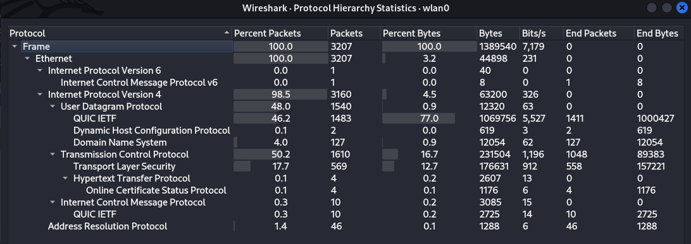

In wireshark, Endpoints refers to devices in a network and Conversations refer to communication between 2 devices in a network. **Statistics > Endpoints** and **Statistics > Conversations** are handy wireshark functionalities that show us helpful statistics for each endpoint such as the number of packets relating to an endpoint. Let's view the conversations for our capture. 

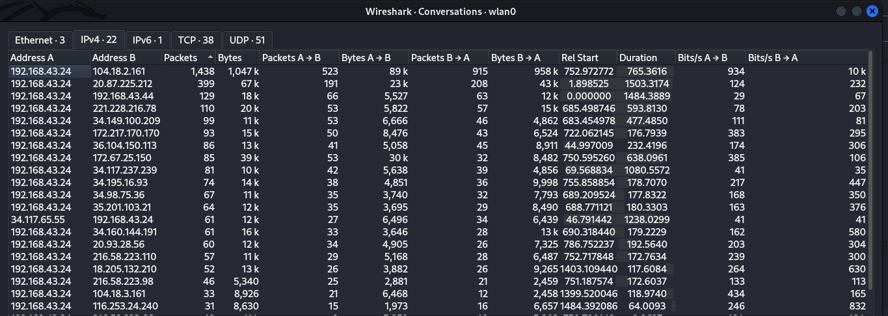

We can see a list of conversations between device A and B. This list offer insights like how many packets are transmitted between two devices, how many are from A to B(A -> B) or (B -> A) and even the duration of particular conversations. This statistics is very informative especially when we are trying to identify **Top talkers** in a network. Top talkers are the endpoints responsibe for the most communications like our device `192.168.43.24` is engaging so much with `104.18.2.161`. When you encouter conversations in your network that you know nothing about, that's suspicious. Use the tool we discussed last time, **whois** , to dig more about the ownership of that IP.

 

### Filters
Going through all packets when analyzing traffic in wireshark is daunting, traumatizing and overwhelming. Wireshark offers two main filters that let's us include interesting packets we only want or exclude ones we dont.
1. **Capture filters** - these are specified during packets capture. They let us selectively capture only packets of interest to us. To set capture filters go to **Capture > Options** then write your filter expression. Filter expressions follow a specific synatx. You can filter on **Ports** and capture ony specific traffic through that port. e.g `port 80` also you may include directions `src port 80`, `dst port 443`. You can filter on hosts and protocols too e.g `icmp`,`udp` `host 192.168.43.24`, `dst host 8.8.8.8`. To combine filters you use logical operators `&& for AND`, `|| for OR`, `! for Negation` e.g `!UDP` catures only traffic that are not UDP.   
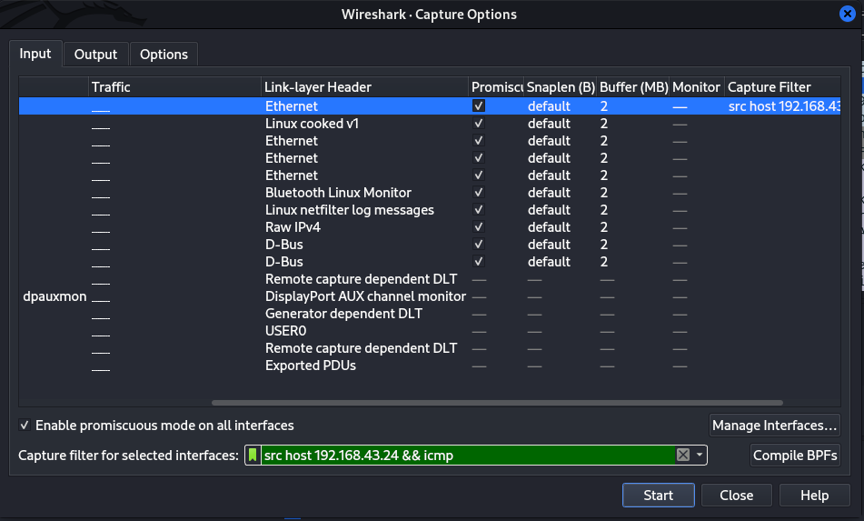  

2. **Display Filters** - display filters allow us to selectively view specific traffic, this makes it easier to analyze. Wireshark display filters are applied at the display filter bar.
- by protocol - `icmp, dns, ftp, !http`
- by IP address - `ip.address == 192.168.43.24`, `ip.dst == 8.8.8.8`
- by Port - `tcp.port == 8080`, `tcp.srcport == 53`
- combining logical operators - `(ip.addr == 192.168.1.100 && ip.addr == 192.168.1.200) && http`
You can also right click on a specific packet then **Apply as Filter > Selected** to directly apply address filters.

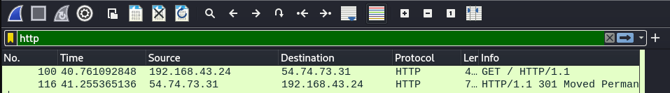  

Check out this [Cheet Sheet](../files/Wireshark%20Cheat%20Sheet-1.pdf) to learn more about Wireshark Filters.

### Name Resolution
Wireshark has a feature called Name resolution with the ability to resolve IP address back to respective Domain names. Rather than displaying ip addresses(8.8.8.8) wireshark can be configured to display respective domain names(google.com), this makes analysis way easier. To enable this functionality, choose **Edit > Preferences > Name resolution**.

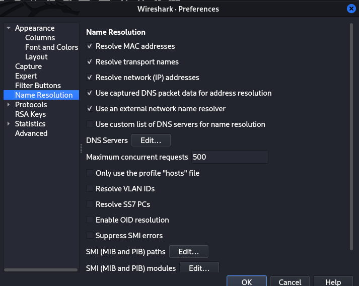

**Resolve MAC Address** - uses ARP protocol to map layer 2 MAC address to it's associated Layer 3 IP address.
**Resolve Transport Names** - converts a port numbr into the name associated with it e,g port 80 as http. This is handy when you encounter an uncommon port and don’t know what service is typically associated with it.
**Resolve IP address** - converts IP address into easy-to-read domin names.

 

### Following Streams
One of the most satisfying analysis feature of wireshark is it's ability to reconstruct data from multiple packets. This allows us to view the entire conversation between a applications and a servers.

Various Data Streams include:[from Practical Packet Analysis book by Chris Sanders]

* TCP Stream - Assembles data from protocols that utilize TCP, such as HTTP and FTP
* UDP Stream - Assembles data from protocols that utilize UDP, such as DNS.
* HTTP Stream - Assembles and decompresses data from the HTTP protocol.
* SSL Streams - Assembles data from protocols that are encrypted, such as HTTPS. You must supply keys to decrypt the traffic.

We can follow HTTP streams by clicking any TCP packet then choose **Follow Stream > HTTP Stream**. HTTP traffic is not encrypted, following HTTP stream can allow us to see the contents of the conversation. Below we can see the user tried to access a webpage with the credentials shown in clear text.

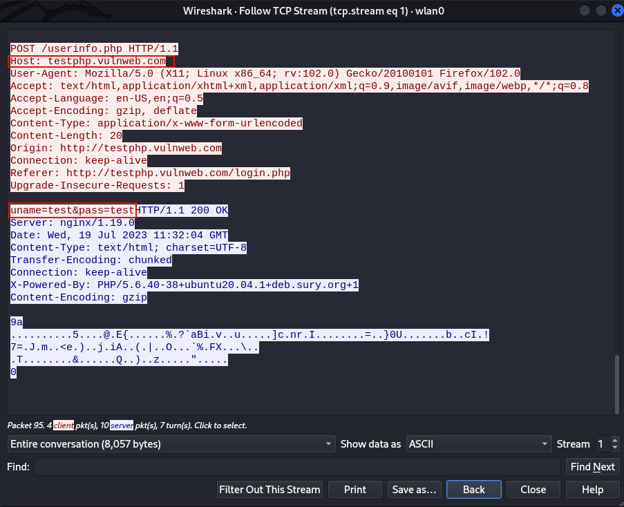

 

Wireshark caprures can be saved in a file with **File > Save as**. Wireshark captures can also be configured to automatically stop and auto save to a file after a number of packets have been collected or for a certain number of duration in **Captures > Options** the click the output tab. Network capture files(trace file) take the format `.pcap`, `.pcapng`

 

### Getting our hands dirty
Time to take a practical approach and solve a network forensics challege from [Cyber Defenders](https://cyberdefenders.com). We'll be solving [Hawk Eye](https://cyberdefenders.org/blueteam-ctf-challenges/91#nav-questions). Download the trace file to follow along. 

#### Some Questions
1. How many packets does the capture have?
2. At what time was the first packet captured?
3. What is the duration of the capture?
4. What is the most active computer at the link level?
5. Manufacturer of the NIC of the most active system at the link level?
6. What domain is the victim asking about in packet 204? 
7. What is the IP of the domain in the previous question? 
8. What OS does the victim computer run?
9. What is the name of the malicious file downloaded by the accountant?
10. What's the name of the malware according to malware bytes?

 

If we open the file in Wireshark, this is how it looks!
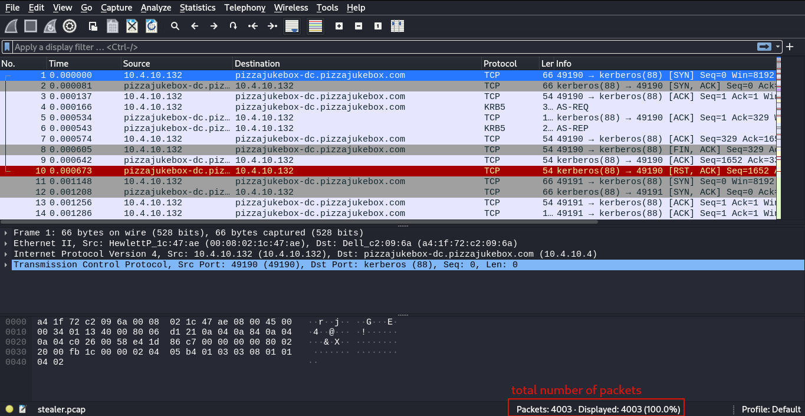

Question 1 answer is the total number of packets shown at the lowermost bar(Packets:4003).  
For Question 2 and 3 we have to view the trace file properties by going to **Statistics > Capture File Properties**
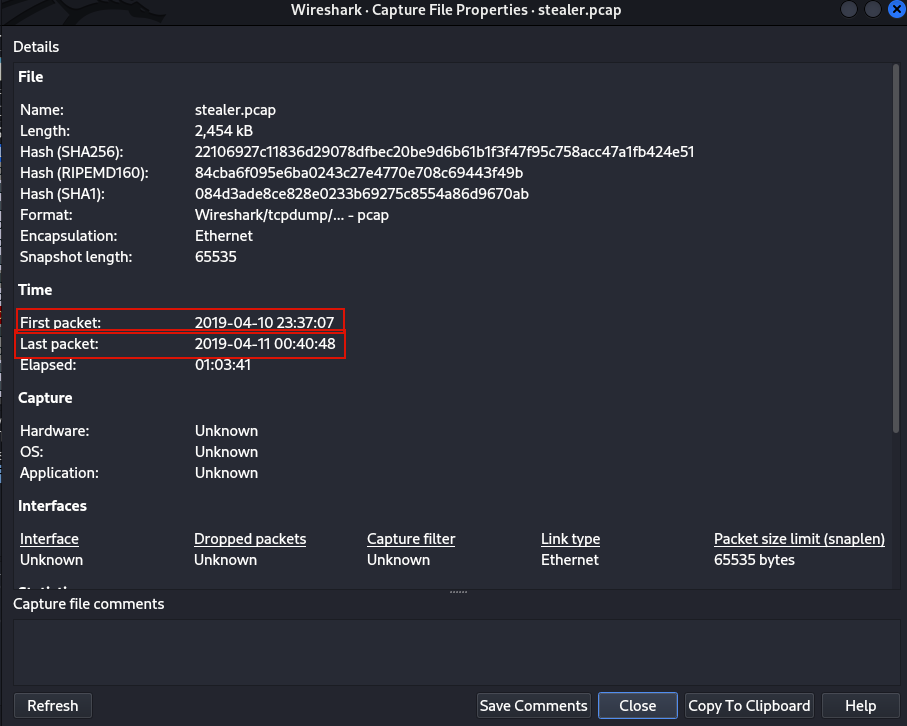  
This infomation about the capture file(metadata) can be displayed using a linux tool called **Capinfos**. Run `sudo apt install capinfos` to install it.
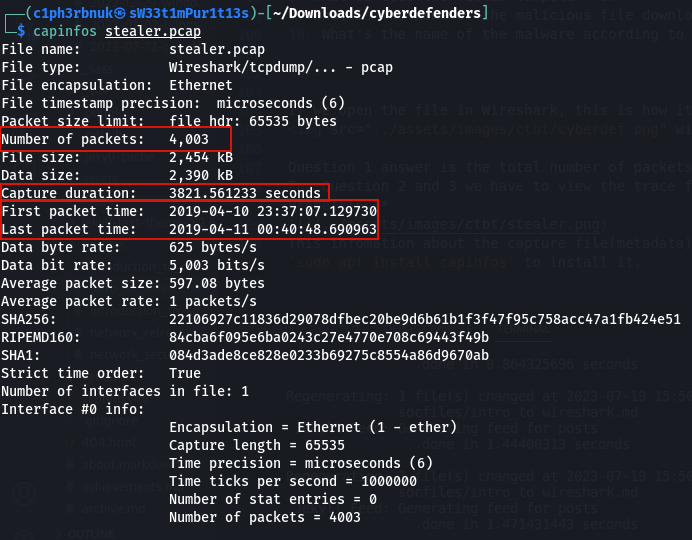 

To answer question 4 we need to find the top talker in **Statistics > Endpoints** then select the Ethernet tab to view the mac addresses(link level). `00:08:02:1c:47:ae` is the most active one. Remember last time we said that the first 3 bytes of any MAC address identifies the Manufacturer. Using this online tool [Mac Address Lookup](https://www.macvendorlookup.com/) we find the answer for question 5 is **Hewlett Packard**.

To find out the answer for question 6, let's view packet 204. It's `proforma-invoices.com`! See how easy it easy to identify domain names with name resolution?
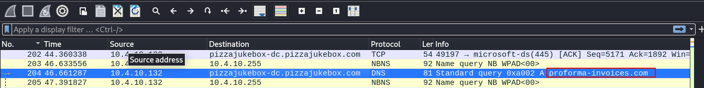
When a user types a domain name(netflix.com) on the web, it's the work of DNS(Domain Name System) to map that to it's corresponding IP. This process is usually in terms of DNS queries and response. To identify the IP address of proforma-invoices.com, we need to lok at the DNS response which is packet 206.

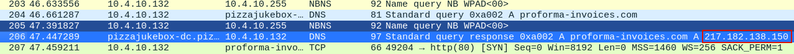

When you access a resource over the web you basically send a GET request to the web server to retrieve that file. If the accountant downloaded a malicious file we should filter for get requests using `http.request.method == GET`

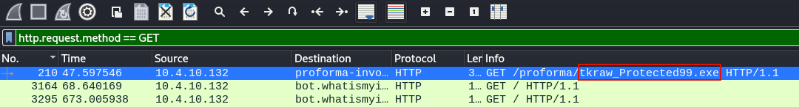

We can see the name of the Malicious file that was downloaded in packet 210. If we right click that packet and follow HTTP stream, the User-agent tells us what Version of OS the victim computer runs(Windows NT 6.1).

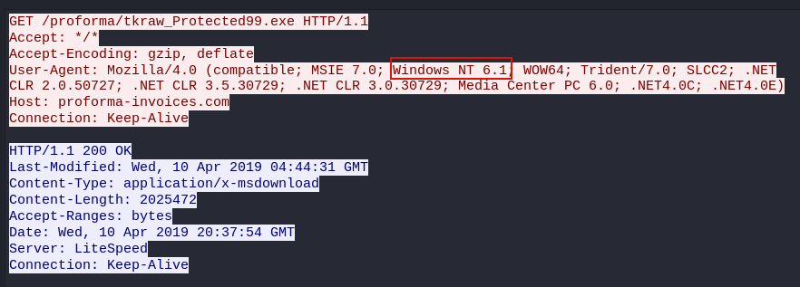

To get the name of the Malware we need to download the file and uploaad it to [Virus Total](https://www.virustotal.com/gui/home/upload), a website to analyze suspicious files. To download it, select packet 210,expand the HyperText Transer Protocol in the Packet details pane then follow the link "Response in Frame: 3155". This will take you to packet 3155. Expand the HyperText Protocol for this packet too, then right click **File data > Export Packet bytes**. Save it with any name. If we run the file command on the saved file we can see it's a windows executable file.

Upload the file to Virus Total and Violla!

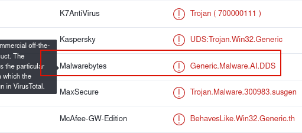

 

Well, that was Wireshark! :astonished:. We've just scatched the surface of what this tool can do. This tool has the ability to display the network flow analysis in graphs and also color-code interesting packets. To lean more about Wireshark and it's advanced features, there's no better person than Chris Greer in his youtube channel. Wireshark provides a user-friendly way to interact with packets, but sometimes we as SOC Analysts may be dealing with lots of trace files that requre automation and sripting. We need a commandline tool with similar functionalities as wireshark but one that will offer us the power to handle large-scale network captures and combine other commandline tools for our analysis. That's where Tshark comes in. Next time we will explore Tshark and take our network analysis to the commandline realm.

Take great care! See ya! :smiley:
