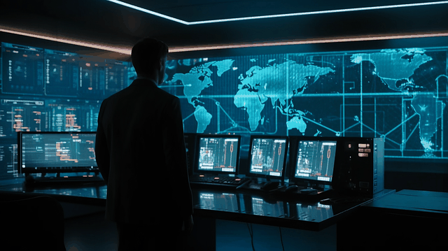

Every mission has an Operation Center. A centralized command center to oversee various activities required to successfully accomplish the mission. A central point of analysis and strategizing. Space explorations have command centers where engineers and scientists, astrounants and mathematicians team up to make desicions and ensure mission success. Militaries have operation centers where all bright minds gather to plan, co-ordinate and execute military operations. Well, to achieve the mission of cyber security of protecting digital assets that we introduced last time we too need an operation center were our team continuously monitor our infrastructures, applications and servers for any suspicious activity. That's where SOC comes in! 

 

### What is SOC?
  

Security Operation Center(SOC) is a cyber security unit consisting of people, processes and technology with a sole purpose of monitoring, detecting and responding to cyber threats. It's the center of an organization cyber security efforts to protect it's assets.  

 

### Why should we care about SOC?  
Hackers are evolving, and cyber attacks now happen everyday with most going un-noticed. SOC offers continuously real-time monitoring of the organization's network traffic for anomalies, system logs and system events for unusual behaviours. With correlation of all these data aggregated from different sources, this unit come's in the first line of cyber defense by investigating incidents, analyzing their imapcts and taking appropriate actions.

"Time is your greatest adversary." That's what Maverick said in Top Gun right? Well, in the event of a security incident, time is of essence. SOC work closely with Threat Hunters to offer timely incident response by proactively hunting for potential threats within the organization that may have gone un-noticed. SOC also leverages Threat intelligence to gain valuable insights about Indicators of compromise and to stay ahead of the attackers tactics, techniques and procedures.

And Lastly, it's the duty of the SOC to assist and make ensure that all systems and applications are compliant with the industry specific regulations for data protections.  

 

### SOC Enviroment 
1. #### People
This is the team of individuals with enough knowledge, skills and experience to triage alerts, make decisions and handle incidents.  
**Roles**
- SOC Analyst - this role is at the front-line and is responsible for the continous monitoring of security events and analyze alerts to discover the root cause of the alert. This role can be divided into Tier 1,2 and 3 depending on the level of complexity of the problem.
- SOC Lead - this position is to lead the team in SOC activities
- SOC Manager - this role is responsible in managing the whole team, offer guidance and organize the operations. SOC managers are also resplonsible for reporting incidents to the CISO(Chief Information Security Officer) of the organization.
- Threat Intelligence analyst - they are responsible for collecting and analyzing infomation about emerging threats and their attack techniques.
- Threat Hunter - Threat hunters proactively seacrh for any signs or indicators that may infer malicious activity within the organization's network. They aim to discover Advanced Persistent Threats(APT) that may have evaded the security measures.

2. #### Process
This is a well-defined methodology to ensure proper incident handling.

3. #### Technology
Technology refers to the tools and infrastructure in place both software and hardware to support people and process in automating detection of activities. A good SOC team should have an excellent toolkit of security tools and technology such as SIEM(Security Incident and Event Management) e.g Splunk, UBA(User behaviour Analytics) and SOAR(Security Orchestration Automation and Response).  

 

To sum it up, SOC is paramount in todays's cyber security landscape. With it's real time monitoring and incident response capabilities, it plays a pivotal role in today's cyber defense. Next time we'll delve into the world of network security. The ability to understand networks in their normal behaviour is crucial for a SOC analyst to uncovering unusual network traffic and other irregularities that might save the organization from hitting major new's headlines like "**Cyber Attack Reveals Lack of Security Measures: Organization's Incompetence Exposed**". We'll discuss network fundamentals and tools like Wireshark used to monitor and analyze network traffic.

 

Take great care! :blush: See ya! :smiley: