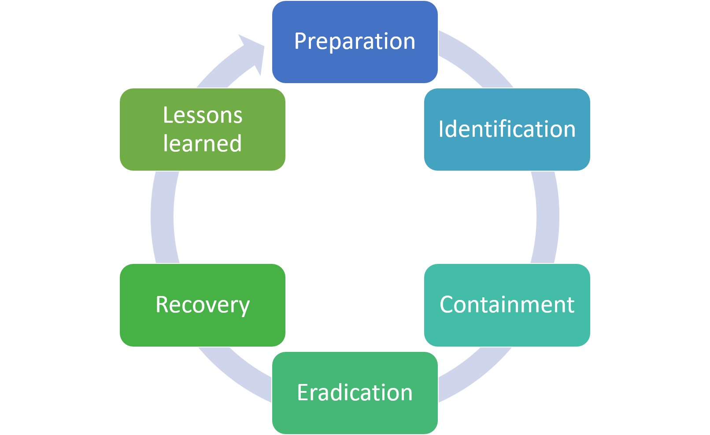

Incident Response is an approach for managing cyber security incidents(DOS, Social Engineering, Ransomware). It involves a set of structured processes that help in quicky identifying, containing and recovering from cyber incidents efectively minimizing the damage and reducing  downtime on an organization's operations.

An Incident Response plan is a documented guidline - specific for an organization - that outlines the procedures to follow when facing a cyber incident. It clarifies different roles and responsibilities and guides on the various activities to be taken.

Facing an incident without a proper plan is stressful. You lack guidance on how to proceed and what to prioritize. This leads to delays and increaed damage.

### The IR Process & Life Cycle
The IR process may differ from organization to organization based on the framework used but the key stages remain as stated below.   
   

1. **Preparation** - this is the initial phase that involves getting ready for an incident by trainning the IR team, acquiring the necessary tools and resources to handle any incident to come, defining communication strategies and even outlining everyone's roles and responsibilities. **Everyone will be hacked, it's just a matter of when not if.** This stage allows organization's to create a robust defense mechanisim. This may involve risk assessments to determine what's potentially vulnerable, configuring tools and technologies ready to protect against malicious activity and user awareness and training on appropriate individual security according to the organization starndards.

2. **Identification** - No matter how well-prepared you are, there's always a chance that a new and unexpected threat could emerge or an employee clicking that phishing link. This phase involves detecting and identifying any indicators of compromise. This could be achieved when a SIEM solution alerts on unusual traffic or an AV product alerting on malware execution. Incident identification would be an easy peasy if every alert were a guarantee of a compromise. Unfortunately, false positives arises and the identification process relies on the man on the ground. The IR team. To proper recognize compromises security teams need to have strong skill sets in understanding of the normal network behaviour and correlating evemts.

3. **Containment** - We are under attack. What do we do now? Should we declare a state of emergency and shut down everything? Well, once an incident is confirmed, it's important to take action to prevent wider spread an infection. This phase involves temporary response to incidents to decrease impacts. Containment stategies my vary depending on the incidents but be wary of turning devices off without full identification of what's compromised. When not carefull some containing strategies may result to the attacker causing more damage. Containment may involve isolating all infected hosts or transfering them to a different VLAN. In cases of phishing attacks, it may require blocking the originating Ip address.

4. **Eradication** - After containing the incident, this step is where you dig deep to identify the root cause of the incident and removing it. It may involve deleting the malware, disabling breached uer accounts, as well as identifying exploited vulnerabilities and performing a system patch. Signatures are also created in this phase.

5. **Recovery** - after the threat has been eliminated, it's time to restore systems to normal operation. It may involve restoring backups and rebuilding sytems.

6. **Lessons Learned** - this is often called the post-incident activities that aim to improving the organizational security measures by reflecting on the incident. What happened? What could have been done better to prevent this? What should improve? What additional tools do we need? In this phase, the IR team updates their playbooks so that they don't suffer from the same incident again. 