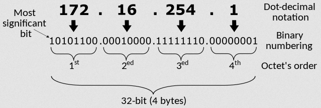
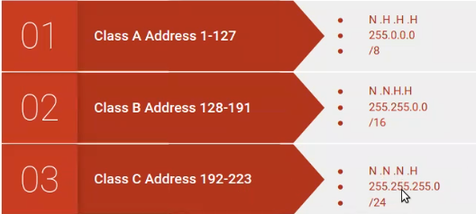
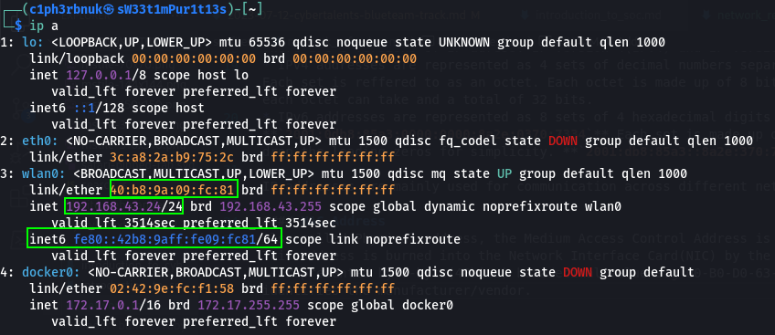
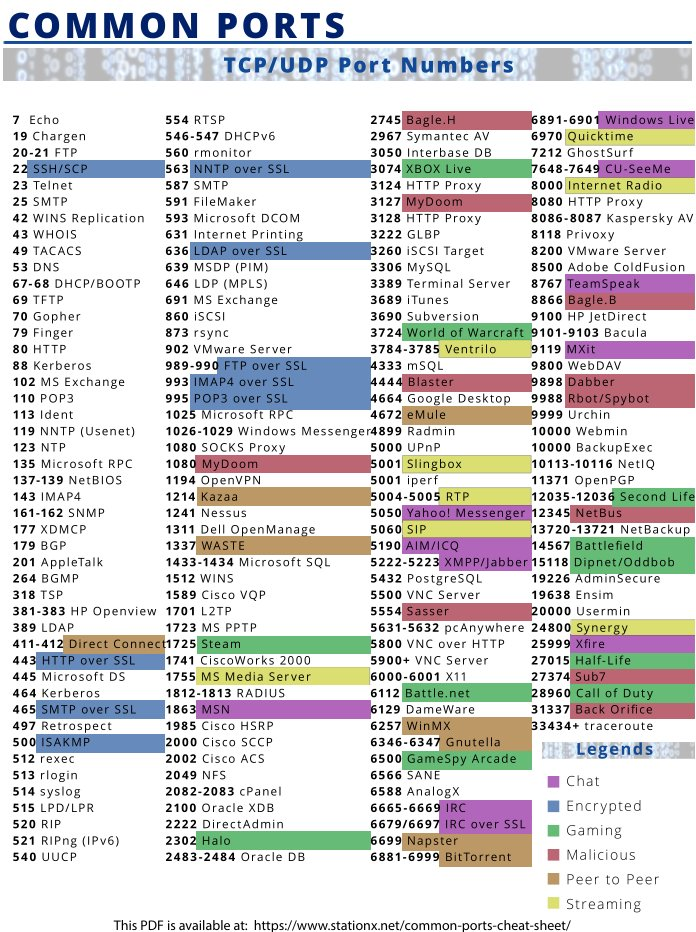
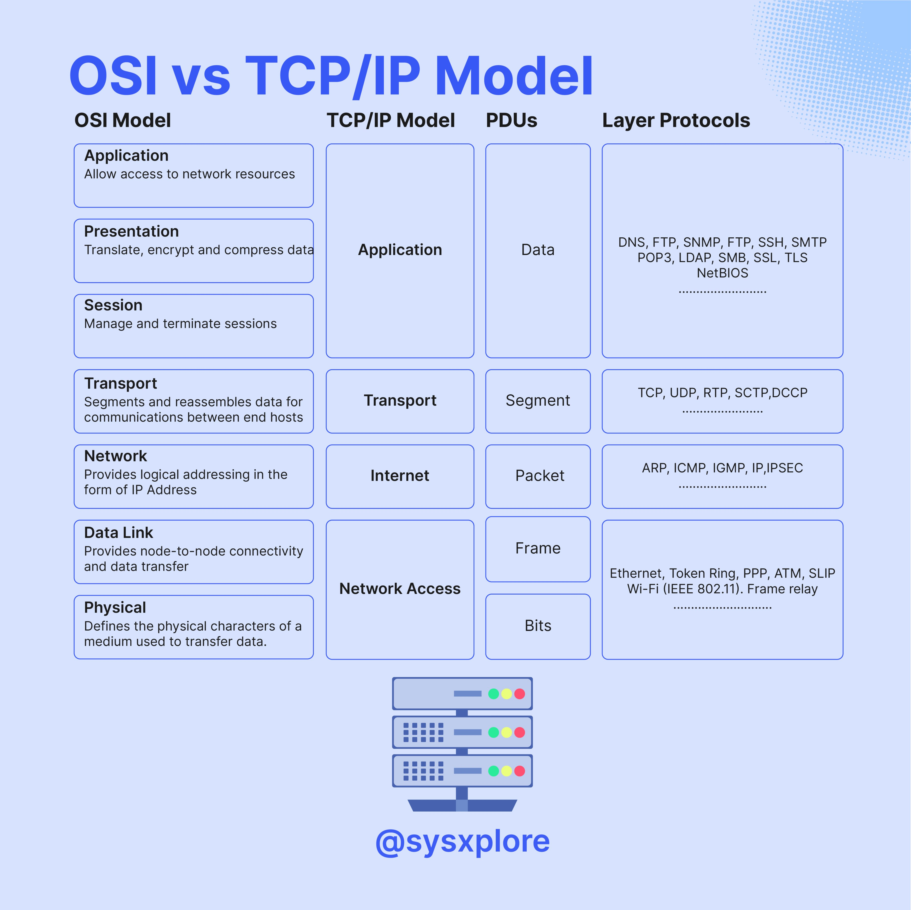
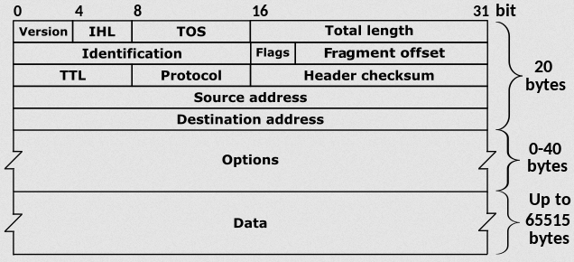
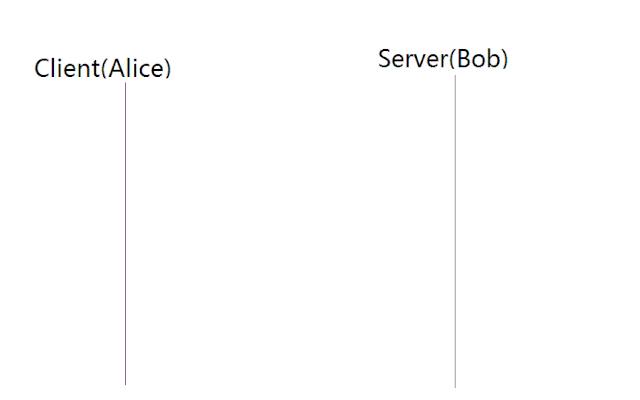
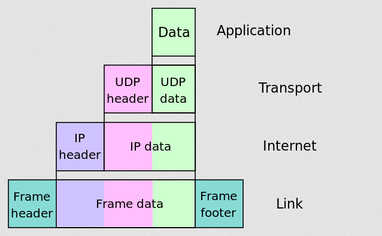

  

Today, let's take a moment to refresh our understanding of the network. As SOC Aanlysts, we established that our role revolves around monitoring and analyzing network traffic. Well, a better understanding of networking concepts - I believe - will allow us to effectively interpret the flow of data in our networks and better detect potential security threats.  
 

### What is a Network?
A network is a collection of interconnected devices such as computers, servers, switches and printers that are linked together to facilitate communication and exchange data. Networks can be of different sizes; small networks like your home network with just your TV, mobile phones, fridge and music system or they can as big as the Internet that connects the whole world.

 

### Data Communication
There are 3 ways data can be transmitted from one device to another over the network.  
* Unicast - most common one. One-to-One coomunication. Single sender. Single receiver. Like when you DM someone, just you two talking.
* Multicast - One-to-Many communication. Sending data to multiple receipients at a time. Like when you chat in a group.
* Broadcast - One-to-All. Sending data to everyone in the network regardless of whether they requested for data. Like posting on status.

### Addressing
#### IP Address
Every device that is connected to any network requires a unique identifier in the network. The Internet Protocol address is the identifier assigned to devices when connected to a network. Just like we use our home addresses in delivery services, the IP address serves the purpose of identifying where data is coming from and it's destination to ensure it reaches the intended recipient.  
There are 2 versions of IP adress: IP version 4(IPv4) and IP version 6(IPv6).  
* IPv4 addresses are represented as 4 sets of decimal numbers separated by a period, e.g **`192.168.2.1`** Each set is reffered to as an octet. Each octet is made up of 8 bits which makes **255** the highest number each octet can take and a total of 32 bits. 

* IPv6 addresses are represented as 8 sets of 4 hexadecimal digits separated by colons e.g **`2001:0db8:85a3:0000:0000:8a2e:0370:7334`** Each set is made up of 16 bits. Just like you thought, we can drop the leading zeros for simplicity. **`2001:db8:85a3::8a2e:370:7334`**

IP addresses are mainly used for communication across different networks.
 

### Subnetting 
Subnetting is a technique in computer networks used to divide a single larger IP network into multiple smaller, subnetworks, also known as subnets. This is done to efficiently utilize IP address space, improve network performance, and enhance security by creating smaller broadcast domains. 

  
A subnet mask is a 32-bit value used in IP (Internet Protocol) networking to determine the network portion and the host portion of an IP address.The subnet mask consists of a series of ones (1s) followed by a series of zeros (0s). The ones indicate the network portion of the IP address, and the zeros indicate the host portion.

Historically, IP addresses were divided into classes (Class A, B, C, D, and E) based on their first octedt as shown. eg. 17.34.67.1 would belong to class A because 17 is in the range 1-127, 165.200.48.3 would belong to class B and so on...this was wasteful of IP address alocation. For example Class A subnet would have 8 bits for network and the rest for hosts as 11111111.00000000.00000000.00000000(255.0.0.0). An IP in class A can accomadate upto 2^hosts_bits, thats 2^24=16777216. No rganization can exhaust such millions of devices. Because of these Classless Inter Domain Routing(CIDR) was introduced. 

CIDR brought efficiency in managing IP address space. In CIDR notation, IP addresses are represented with a combination of the IP address and a slash ("/") followed by a number, which indicates the length of the network bits eg. 192.168.20.1/8 indicates there are 8 bits for network a the rest for host giving this IP a subnet mask of 11111111.00000000.00000000.00000000(255.0.0.0). This brought flexibility allowing network admins to create subnets of different sizes based on their needs. Same IP could be subnetted with slash 22(/22). Here we get 22 bits for network and 10 for hosts. 1111111.11111111.11111100.00000000(255.255.252.0)

Learn more subnetting from [Professor-Messer](https://www.professormesser.com/network-plus/n10-007/classful-subnetting/)  

[Subnetting Cheat Sheet](../files/Subnet-Guide.xlsx)

#### MAC Address
Also called Physical address, the Medium Access Control Address is used for communications in a local network. This address is burned into the Network Interface Card(NIC) by the manufacturer. It's unique to every NIC and is represented by 6-byte(48bits) hexadecimal value e.g 00-B0-D0-63-C2-26. The first 3 bytes of the mac address identifies the manufacturer/vendor.

To see this addresses in your computer, use **`ip a`** for linux, **`ipcofig`** for windows and **`ifconfig`** for mac.

### Ports, Protocols and Services
A protocol is a set of rules that govern communications in computer networks. A port is a logical construct in networks that uniquley identifies services running on a device. There are total of 65536 ports numbered 0-65535. The first 1024 ports(0-1023) are reserved for commonly used services. The rest are available for dynamic use.

#### Common protocols

* File Transer Protocol(FTP) - running on port 21 this protocol is responsible for file transferes across devices in the network.
* Secure Shell Service(SSH) 22 - provides secure remote access to devices over an encrypted connection. Telnet(23) is also for remote connections but it's not secure.
* Simple Mail Transfer Protocol(SMTP) 25 - used for sending emails.
* Domain Name Service(DNS) 53 - responsible for translating domain names(yourfavdomain.com) into numerical IP addresses(172.34.5.9). Imagine if you had to remember all the IP address of your favourite sites inorder to access them...Gosh!
* HyperText Transfer Protocol(HTTP) 80 - used fpr accessing resources over the internet.(http://example.com/sweetest.jpg)
* Secure HTTP(HTTPS) 443 - provides additional encryption on the web for secure commmunications.
* Dynamic Host Configuration Protol - used to dynamically assign IP addresses in a network.
* Adress Resolution Protocol - used to map MAC addresses associated with a given IP address.
* Internet Control Message Protocol(ICMP) - this protocol is maily used for error reporting and diagnostics purposes. Anytime two devices are connected through the internet, ICMP can be used to create errors that can go from the receiving device to the sending device if some of the data did not arrive as expected(source -fortinet). Note that ICMP messages are encapsulated within IP packets. ICMP doesn't use ports. So as a SOC analyst, if you observe ICMP traffic on a specific port in your network, it likely indicates ICMP tunneling - a technique used by attackers to carry other types of network traffic within ICMP packets. 

 

Research more about your favourite protocol. :smiley:

### Network models

There are 2 models in computer networks that are used to describe the function of a networking system and clarify the data transmission routine done in a network connection cycle.(Cybertalents).

1. The OSI model - consisting of 7 layers, this is a conceptual framework developed by International Organization for Standardization (ISO) to help better understand how various protocols interact to facilitate communication. Physical Layer being the lowest layer up to Application Layer. The infographic above created by @sysxlpore shows the different functions of each layer. These Layers may also be refered to Layer 1, Layer 1... upto Layer 7 starting from the physical layer.

2. The TCP/IP model is a more practical and widely used networking model that is closely aligned with the actual protocols and technologies used on the internet. It is named after its two foundational protocols: TCP (Transmission Control Protocol) and IP (Internet Protocol). It consists of 4 Layers; Network access, Internet, Transport and Application.

### Internet Protocol
  
The Internet Protocol is the protocol that enables Internetworking at the Internet layer of the TCP/IP model. It uses Logical addressing(Ip address) to forward packets(data at the network layer - see encapsulation below) from source to destination. See [IPV4](https://www.ibm.com/docs/en/aix/7.1?topic=protocols-internet-protocol) for the description of the header fields above. IPv4 is a connectionless protocol, in that it does not guarantee delivery, nor does it assure proper sequencing or avoidance of duplicate delivery. These aspects, including data integrity, are addressed by an upper layer transport protocol, such as the Transmission Control Protocol (TCP)(Wiki)

### TCP
The TCP protocol is a main protocol in the TCP/IP protocol suite [Wiki](https://en.wikipedia.org/wiki/Internet_protocol_suite) which operates at the Transport layer. It provides reliable and connection oriented(connection between client and server is established before data can be sent) communication between devices. It uses sequece numbers to ensure data is delivered in order and without errors.

#### The TCP 3 way Handshake
Before any data transmission can occur, TCP establishes a connection between the client and the server using what's called the TCP 3 way handshake. 

   
* #### Step 1 SYN(Synchronize): 
The client initiating the connection first sends a TCP segment to the server with the SYN(Synchronize) flag set. This segment contains a randomly generated sequence number (SEQ) that the server will use to identify the data it receives.  
* #### Step 2 SYN-ACK (Synchronize-Acknowledge): 
Upon receiving the segment, the server acknowleges the request by sending a TCP segment back with both SYN and ACK flags set. The server includes it's own random sequence number but it uses the clients sequence_number+1 as it's acknowledgement to indicate that it has received the client's initial sequence number.  
* #### Step 3 ACK(Acknowledgement): 
Finally the client responds with another TCP segment that has ACK flag set and an acknowledgement number of server_sequence_number + 1. Now, both devices have established a reliable connection and are ready for data transfer.

For a deep dive on how TCP works, check out [Chris Greer](https://www.youtube.com/@ChrisGreer)  

### TCP vs UDP
User Datagram Protol(UDP) and TCP are protocols both used in the Transport layer.
* TCP is connection oriented as we saw it established a connection first before data transfer with the 3 way handshake. UDP is coonnectionless therefore does not guarantee reliability.
* Unlike UDP, TCP impelements flow control to ensure data being sent doesn't overwhelm the rceiver.
* UDP is faster and is preferred for real-time communication and applications where low latency is more important than reliability like Video streaming.

### Encapsulation  

This is the process of concatenating layer specific headers/tailers as data units are passed down the OSI layer. Each layer adds its own header to the data, creating a layered structure known as a protocol data unit (PDU).(Wiki) Encapsulation allows for the transmission of data across a network by providing the necessary information at each layer. When data at the application layer is passed down to the transport layer, the transport layer adds either a TCP or UDP header which contains the source and destination port numbers, sequence numbers to ensure order...and more. This Unit in whole becomes a segment.
The segment is the handed over to the network layer where the Ip header is added with infomation about the sorce and destination Ip address, Time To Live(lifespan)...this becomes a packet. The packet again gets to the Data Link Layer where a new header and a tailer are added with the source and destination MAC addresses.This frame now gets to the Physical layer where it is converted into bits for transmission.

  

I know :frowning:, "That was boring! We already know these!". Well, the key take here is how this understanding of computer networks can help us as SOC analysts. Knowing that MAC addresses are to be unique might help us notice attacks like [ARP-Spoofing](https://www.imperva.com/learn/application-security/arp-spoofing/) whenever we encounter duplicate MAC addresses from different IPs. The knowledge that ICMP doesn't run on any port offers us the confidence of saying "Someone is doing something they shouldn't!" next time we see it runing on port 1234 in our network. IS Someone exfiltrating our data????

 

Next time, we'll discuss network security and its tools. We'll explore firewalls, intrusion detection and prevention systems, VPNs, and other security measures that fortify your network against malicious activities.

Onward to secure horizons! Take care! See ya! :smiley: