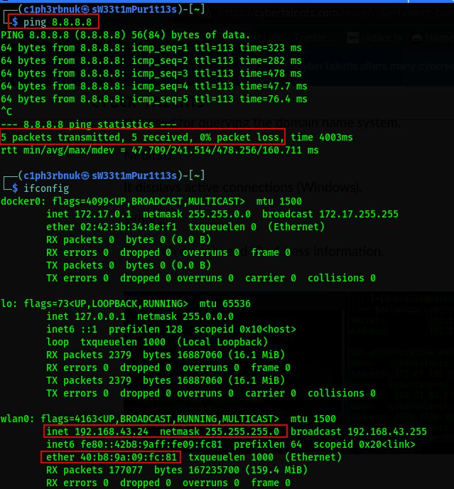
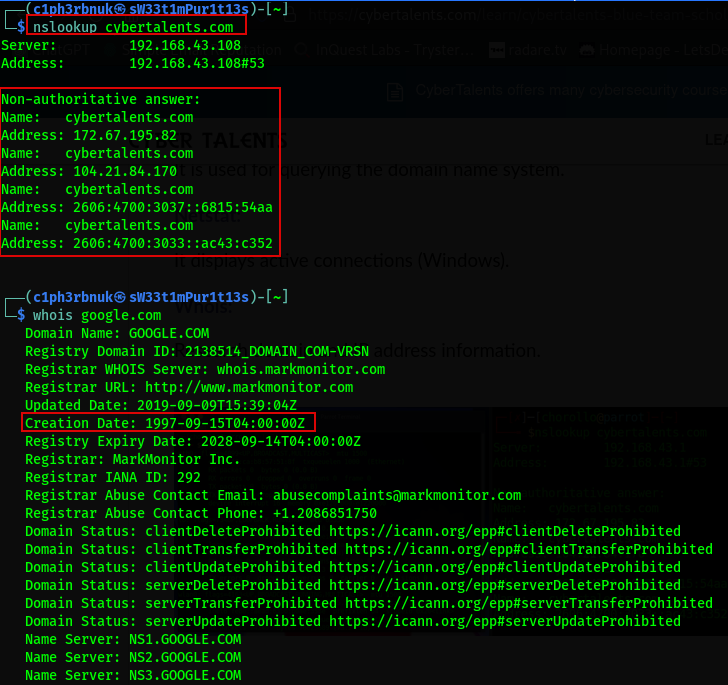
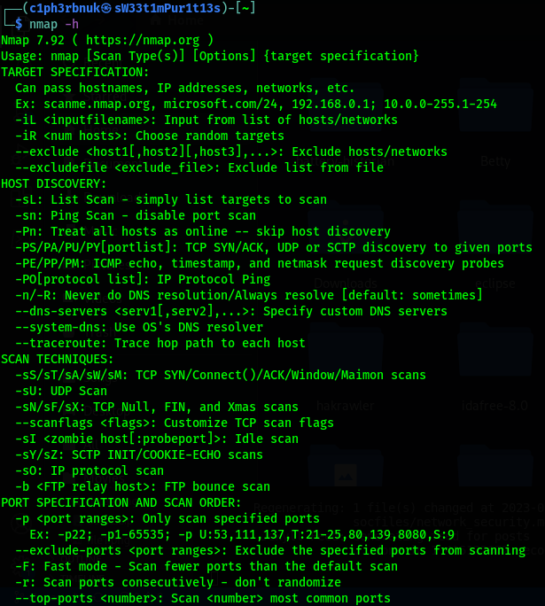

### What is Network Security?  
Network security is the field of cybersecurity focused on protecting computer networks from cyber threats[IBM]. The primary goal of network security is to create a secure environment where legitimate users can access network resources while preventing unauthorized users from gaining access or causing harm. Achieving Network Security involves the implementation of various tools and technologies to ensure confidentiality, integrity and availability of data transmitted over the network.

 

### Network Security Protections
1. **Access control** - this is the process of managing and regulating access to systems and resources. Access control ensures that only **authorized** users can access the **appropriate** resources and helps protect sensitive data.  
**Methods of access control** 
- Authentication - authentication is all about verifying identity of users. It's about users prooving that they are who they say they are. There are 3 categories of factors used to verify users.  
a. Something you know - could be a pin, password or security questions and when the user gets correct is granted access.  
b. Something you have - involves possession of a physical device or object that uniquely identifies the user; a smart card or maybe a security thumb drive that must be plugged in.  
c. Something you are - this is about unique biometric characteristics of each individual(fingerprint, facial recognition, voice recognition...)  
Combining 2 or all these factors enhances security significantly.  
- Authorization - After a user is authenticated, based on their authentication identity(Admin or Normal user) you need to determine the level of access privilege they should have. This ensures every user access resources they are permitted to.  
[Active Directory](https://learn.microsoft.com/en-us/windows-server/identity/ad-ds/get-started/virtual-dc/active-directory-domain-services-overview) is a great service to enable network admins manage permissions and control access to network resources.  

2. **Firewalls** - firewalls could be software/hardware based. They are normally placed at the perimeter bordering the organization internal network and the public internet. Firewalls primary purpose is to monitor and examines incoming and outgoing traffic based on a set of predefined rules then make desicions on whether to permit or deny the packets.
**Firewall Types**
- Packet Filters Firewalls - These are more traditional. They examine individual data packets based on information such as source and destination IP addresses, port numbers, and protocols. They also lack logging capabilities making them impractical. Firewall logs provide SOC analysts with critical insights such as unauthorised access attempts and other signs of malicious activity.
- Application Level Firewalls - also known as proxys, these have additional ability to inspect actual content of the packets.
- Next Generation firewalls - these are employ more advanced technologies such as deep packet inspections and Intrusion prevention systems.

3. **Intrusions Detection and Prevention Systems** - An Itrusion Detestion Systems(IDS) monitors network traffic and based on matched rules for suspicious behaviour it alerts security personnel. While IDS only detects Intrusions Prevention System(IPS) has the ability to take actions. It goes beyond alerting and responds to possible breaches by blocking the malicious traffic from reaching intended target. IPS is effective for DOS(Denial of Service) attacks. It can detect patterns such as unusually high volume of traffic from specific sources and employ rate limiting of traffic.

4. **Virtual Private Network** - this is a technology that allows users to establish a secure and encrypted connection between their devices and a private network over the internet. When a remote employee is accessing company's resources, they use a VPN client software in their desktops and establish a secure connection to the company's VPN server. This server acts as the gateway for remote employees to connect to the internal network. Once connected, all data transmitted over the public internet between the remote employee's device and the VPN server is encrypted, and it appear as if the user's device is part of the company's internal network.
[Learn More types of VPN](https://www.kaspersky.com/resource-center/definitions/what-is-a-vpn)

 

### Networking Tools and Commands
`ifconfig` - this tool shows the network interface configuration of a device. (`ipconfig` is an alternative for windows).  

`ping` - used to test reachability of a host(device) in a network. When you ping a device you send ICMP Echo request and if the host is online(UP) it'll send back an ICMP Echo reply.  

  

`nslookup` (Name Server Lookup)-  querys the Domain Name System (DNS) to obtain information about domain names, IP addresses, and various DNS records. 

`whois` - used to obtain information about domain name registrations and their associated details. As SOC analysts we can use this took to inspect a suspicious domain. Maybe it's creation date, who owns it(if not private)...

 

`netsat` (Network Statistics) - it's utility to display network related info like active network connections. It can help SOC analysts identify active connections with their hosts. 

`nmap` (Network Mapper) - this is a powerful network scanning and Host discovery tool. It's used by Ethical hackers and malicious actors to discover open ports and services running on a system, their versions and what thype of OS the device runs on. Ethical hackers use to identify security flaws such as outdated version of applications that are vulnerable to attacks. As SOC analysts, we can use this tool to monitor changes in our network and detect newly opened ports. 

Please Check this [Nmap Guide](../files/Nmap_beinner.pdf) for details on how to use the scan options.

 

We've discussed network security and some of the technologies available to safeguard our networks and protect ourselves from malicious actors. Moreover, we've reviewed some useful utilities and tools that help us discover our enviroments. In future series i'll demonstrate how to configure **pfsense** firewall and also take you through a practical exploration of **Snort**, an open-source intrusion detection and prevention system.  

But next time, we'll learn how to use **Wireshark**, the world's most populalr network protocol analyzer. Wireshark will let us capture network packets, filter specific ones and analyze them.

Until then, stay curious! See ya! :smiley: