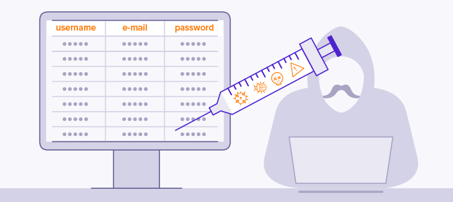

**Structured Query Language** is the language used to interact with relational databases.  
`Relational databases are databases whose data is stored in tabular format. Each record of data is a row with multiple column fields.`  
SQL offers the folowing statements for managing relational databases.
- **SELECT statement** - retrives records from a table. `SELECT column1, column2 FROM table_name`
`SELECT * FROM table_name` (retrives records for all columns)
- **UPDATE statement** - modifys existing records in a table.
- **INSERT statement** - creates records in a table.
- **DELETE statement** - removes records in a table.

 

### What is SQL Injection?
**SQL injection (SQLi) is a web security vulnerability that allows an attacker to interfere with the queries that an application makes to its database** [portswigger]. An attacker could include malicious SQL payloads inside SQL queries which may allow them to gain un-authorised access or retrieve sensitive information.

 

### Bypass Login
Consider an application login module that takes a username and a password then performs a SELECT query (`SELECT * FROM users WHERE username = '$username' AND password = '$password`) and if records with the given credentials are found the user is logged in.
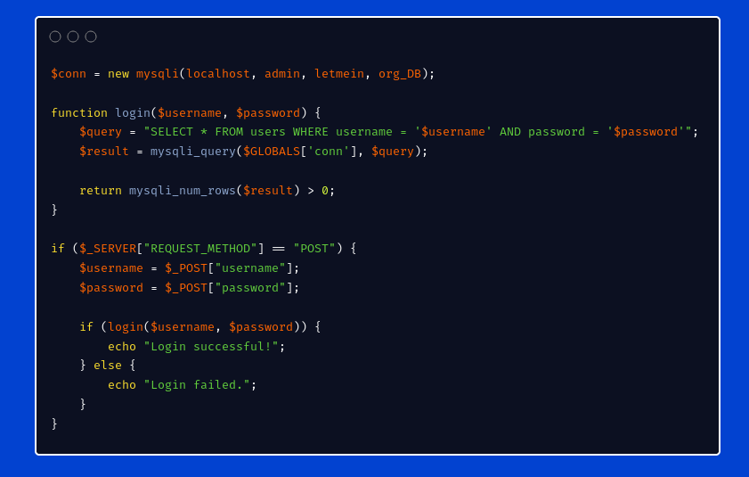

The attacker could submit the string `Admin' OR 1=1 --` as their username and any password.
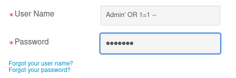  

The single quote `'` will close username string and the boolean condtion **1 = 1** will make the whole query return True since 1=1 is True(returning all users in the database). The double dash `--` is a character used in MySQL for comments. This will force the final part of the query to be commented out thus disabling the password check and granting a successful login as the Admin.
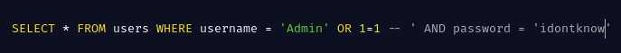

 

#### Retrieving Data from other tables
The **Union** operator is used in SQL to combine results from 2 SELECT statements. The results MUST be compatible with each other (Same number of columns and data type).

An attacker could abuse this keyword and perfom a UNION-Based SQL injection to retrieve records from other tables. Because of the compatibity problem, the attacker must first know the number of columns return by the original query. This is important to ensure a successful attack.

**NULL** - the NULL keyword is used to represent missing data or unknown values in databases. 

In quest for the number of columns for the original query, the attacker can retrieve NULL for columns in the injected query while observing the server responses for errors.

`NOTE: When i say original query i refer to the legitimate query made by the database that the attacker aims to interfere with. When i say injected query i refer to the payload the attacker includes in the original query.`

Suppose an online shopping application performs the query below to filter displayed products based on user's input in the search bar (say electronics).   

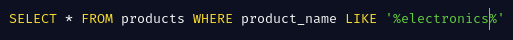

The attacker can inject the payload `' UNION SELECT NULL --` then observe for databases errors or generic errors. MySQL usually returns `The used SELECT statements have a different number of columns`. With this the attacker can gradually increment the NULLs for columns and when the number of columns are matched the application will often respond since an extra row of nulls would have been be included in the result set.

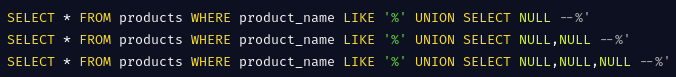

What happens after an effective column count?? Let's say the attacker identifies that only 3 columns are returned(say product name, description and price). They further would want to determine the datatypes of these columns. They do this by placing a string value at each place of the column and observes errors when the query breaks because of conversion failures.   

`Note: When you select a string on a column that expects an integer the conversion "string to int" cannot be done. Intergers can be converted to strings.`

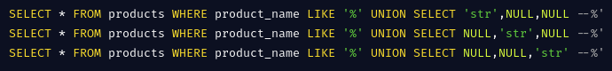

For our example, the attacker will encounter no errors therefore finding out all the 3 columns can take a string value. If the attacker knows that there exists a table called `users` which contain columns `username` and `password`, they can inject the payload `'UNION SELECT username, password, NULL FROM TABLE users--` and all users credentials would be leaked and displayed together with the electronics products.  

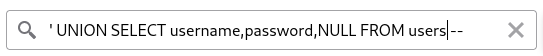

 

#### How would they know what tables exist?
Before executing their prefered statement, the attacker can start by gathering information about the database. 
To determine the database version the attacker can query `SELECT @@version`. This will work for MySQL/Microsoft databases. Here's a list of different queries to determine the database version for particular database management systems. They could try all these till they get that which works.  

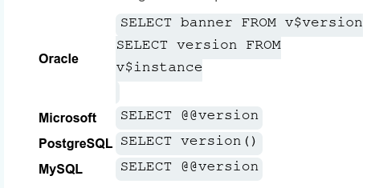

For most relational databases the `information_schema` contains information about tables within each database and even columns for each table. With the pyload below the attacker can retrieve all table names within a database. 
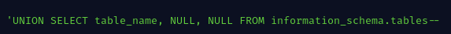

Once the attacker identifies interesting tables(say users_credentials) they can use the payload below to return all column names for that table.

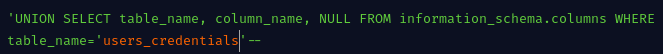

Finaly they can retrieve specific columns from that table with:

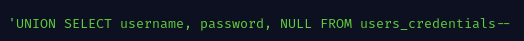

And just like that! Pew Pew! :laughing:

 

SQL injections can be more complex than just the error based we've discussed. In cases where the application doesn't generate errors an attacker could employ advanced higher order SQL injection and perhaps cause Time delays for the responses allowing them to infer the existence of this vulnerability based on the delay.

For more on SQL injection please check out the [Web application Security academy](https://portswigger.net/web-security/sql-injection#what-is-the-impact-of-a-successful-sql-injection-attack) by portswigger! Also [Rana Kalil](https://www.youtube.com/c/ranakhalil101) has an awesome youtube channel where she covers many web app vulnerabilities in detail.

SQL injection vulnerabilities can have devastating impacts to an organization like authorised access, sensitive data exposures and more.

#### Mitigating SQLi
- Sanitize users input - Never trust the user. Validate all inputs from the user to ensure that user-provided data meets expected formats and does not contain malicious characters or SQL keywords.
- Use parametized query(prepared statements) - prepared statements ensures that the input parameters are separated from the SQL query. The query only contains place holders.  

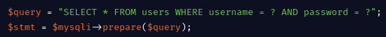

 

As SOC analysts, to detect when this vulnerability is being exploited, we can monitor client requests for SQL injections patterns like bolean expressions and suspicious characters like single quotes. Attackers may obfuscate their payloads as ascii characters making it hard to detect. Tools like WAF can really help alert for any SQL injections attempts.

Next time we'll explore the Directory traversal vulnerability in brief. This vulnerability allows attackers to navigate through folders and access files out of scope. See you next time! :smiley:
