This was part of an 8 round series CTF every friday for 8 weeks. This week I placed 3rd <span style="font-size:1.5rem;">🥉</span>

### Forensics
Forensics is one of my favorite categories. I managed to clear all challenges in this category. The task was to extract windows artifacts from a forensics image file. You get to learn about the windows configuration files, registry keys and use of forensics tools that comes handy in real inciedent investigations.

The image file provided was `Host.ad1` file. `.ad1` files are created by the Accessdata FTK Image software. Unlike the `.E01` or `.dd` image files, `ad1` are usually lightweight because they are a logical file instead of a full disk image. It contains selected files or folders that the examiner chooses to capture rather than the entire disk.

#### Hostname
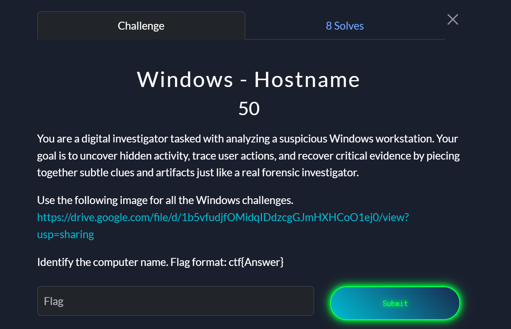
The Windows registry is a very large databse that stores configuration settings for Microsoft windows and it's applications. It holds artifacts valuable in Digital forensics. I wrote an entire article here [Registry Forensics Cheatsheet]() about its structure and main registry key that holds artifacts about system information, user activity, network information, etc.

Information about the Computer name can be foumd under `SYSTEM\ControlSet001\Control\ComputerName\ComputerName`. However, FTK Imager can't parse registry keys directly. It rather lets you browse the file system structure inside the image. We need to export the registry hives like `SYSTEM` which can be found under `Windows\System32\config` to our local machine and then open them with tools like Registry Explorer or Autopsy.

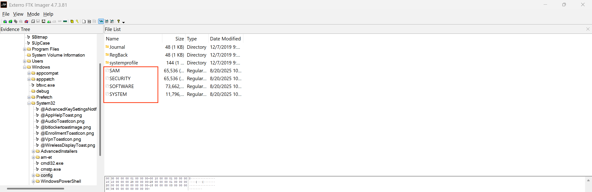
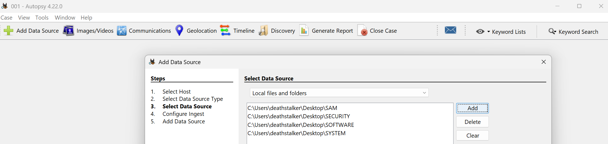

We can then navigate to the registry key above and get computer name information.
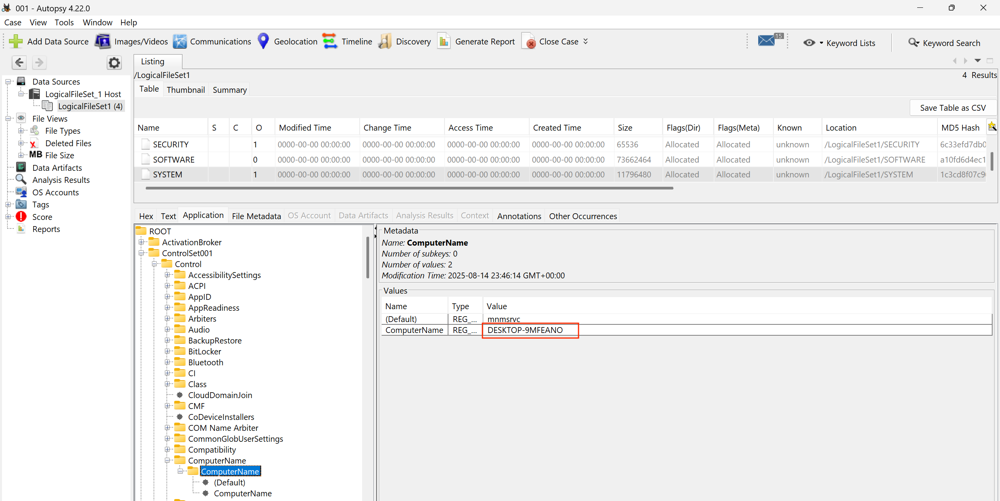

#### Suspicious Tool

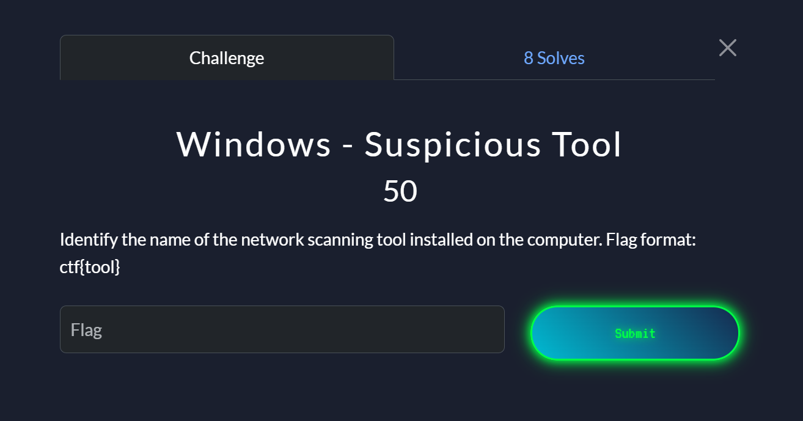

All installed applications on Windows are often stored under `C:\Program Files`. So if we naviagate there we can see the `Angry IP Scanner` tool which is a network scanning tool. 

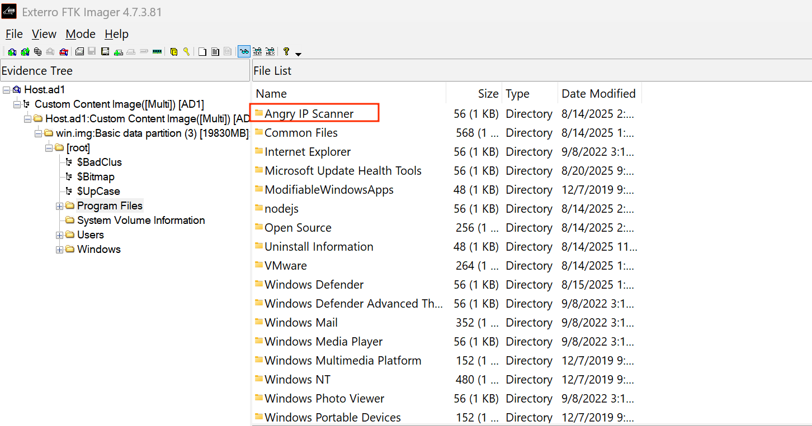

#### Execution

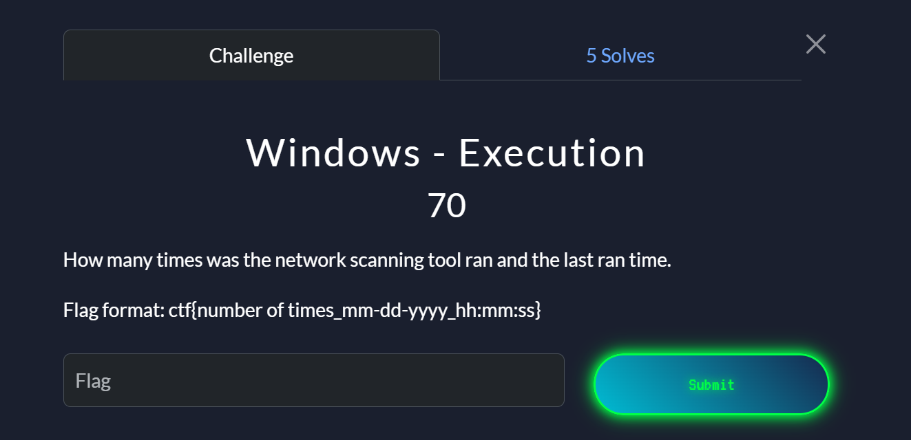

Windows creates a prefetch file(`.pf`) under `C:\Windows\Prefetch` the first time an application is run. Everytime the program runs again, windows updates that `.pf` file by incrementing the value within a field named `Run Counter`. This field holds the number of times the program has been executed. There is also a `Last run time` field that records the exact all the times the program was run. We can extract this file and save it in our prefetch folder then use this tool [WinPrefetchviewer](https://www.nirsoft.net/utils/win_prefetch_view.html) to view our prefetch files. 

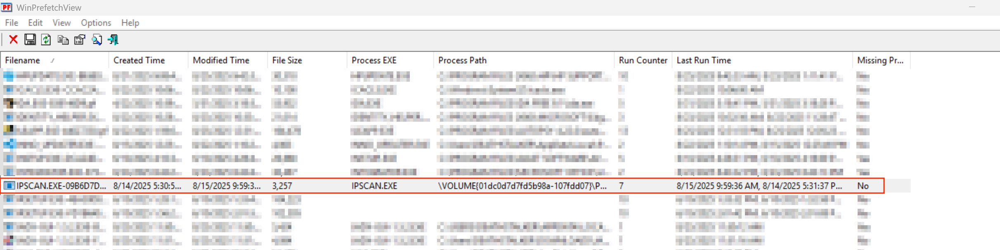

We can see the scanner was run 7 times with the last run time as `8/15/2025 9:59:36 AM`

#### Footprint

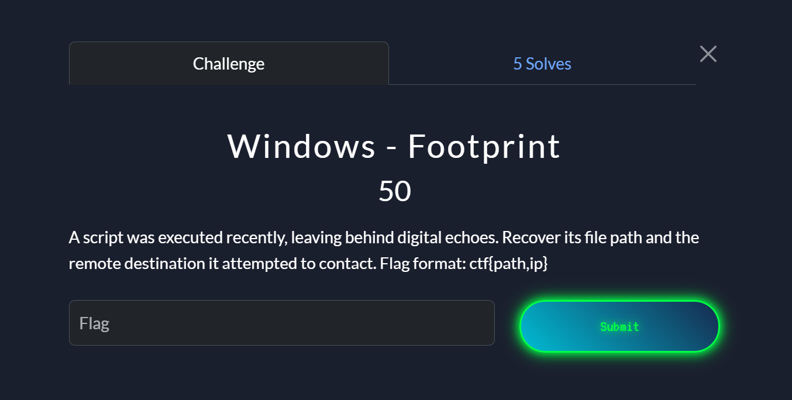

This we can find from the Roaming data for the Test.

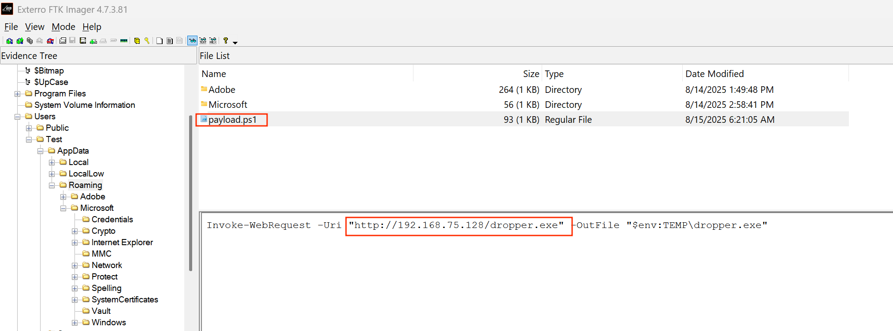

#### Persistence

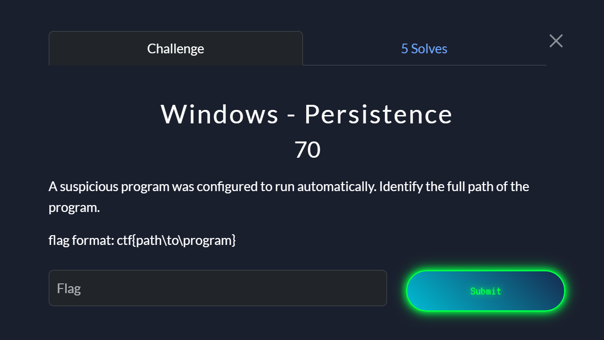

Persistence is a technique used by attackers to maintain long tern access on a compromised system even after reboots and system shutdowns. Some common persistence spots on windows include: 
- `Registry run keys` like "HKLM\Software\Microsoft\Windows\CurrentVersion\Run" and "HKCU\Software\Microsoft\Windows\CurrentVersion\Run" contain entries that Windows look at whenever it starts and runs whatever it is listed.
- Any program shortcut placed under `Startup Folder` "C:\Users\<User>\AppData\Roaming\Microsoft\Windows\Start Menu\Programs\Startup" (per user) or "C:\ProgramData\Microsoft\Windows\Start Menu\Programs\Startup" (all users) automatically runs whe the user logs in.
- `Windows Task Scheduler` lets you create jobs under "C:\Windows\System32\Tasks\" that run at start-up, at login or at specific times. 
- `Windows Services` listed under this registry key "HKLM\SYSTEM\CurrentControlSet\Services" run in the abckground often before login.

If we browse the `NTUser.dat` file under `SOFTWARE\Microsoft\Windows\Currentversion\Run` we can see a key value pair `Updater` :  `C:\Users\Public\Tools\scanner.exe`

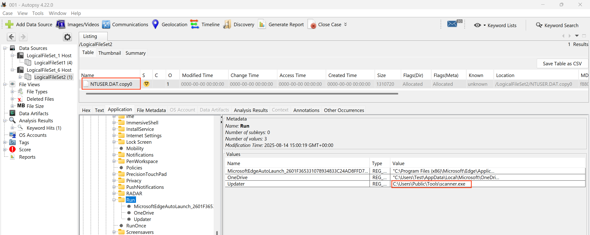

#### Identity
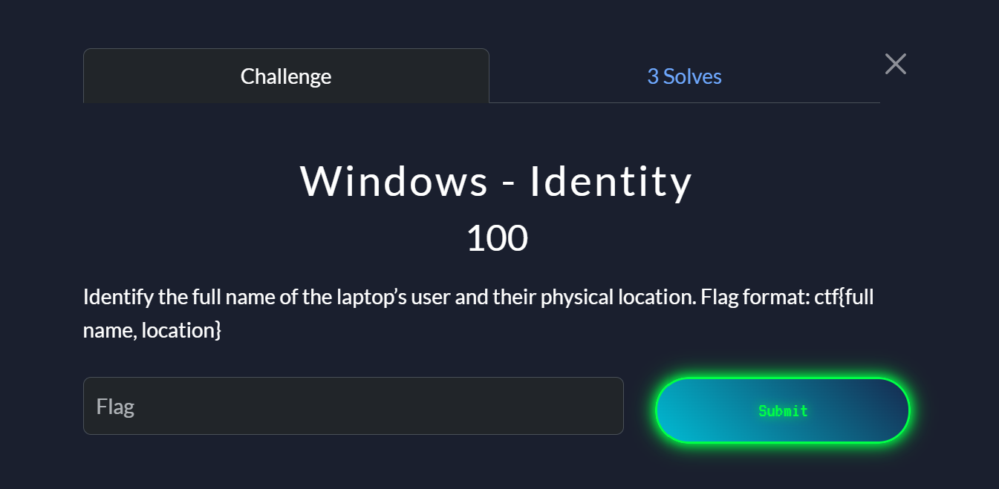

Most of the time the information about User accounts can be found in the SAM file but the users in this specific host registered their account as "Test". I spent too much time looking for the user's full names and finally i managed to find the users CV under `AppData/LocalLow/Microsoft/.Personal/CV/Ricky David CV.docx`
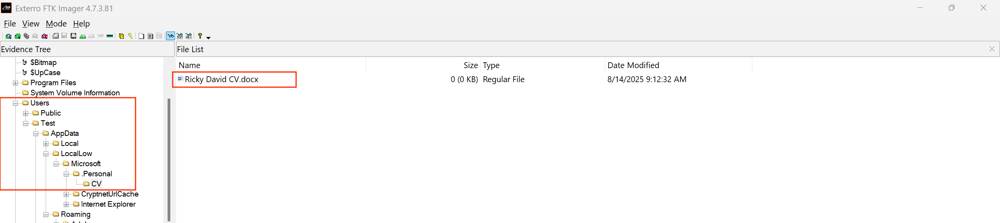

There was also an image file of the user's laptop under `Pictures\Saved Pictures\laptop.png`. 
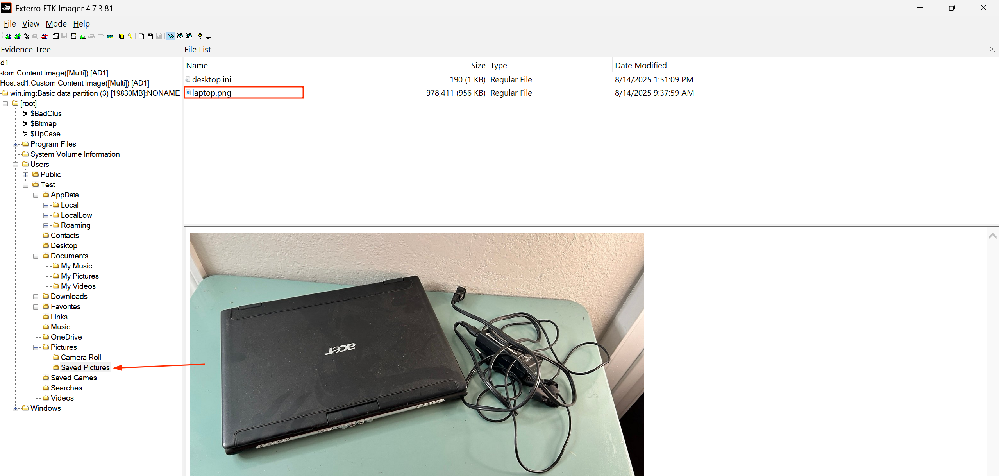

When a photo is taken with a smartphone EXIF metadata can include GPS coordinates (latitude, longitude) which can be used to pinpoint the exct location the photo was taken. After extracting the image and viewing the exif data, we can see the location data from the image. 

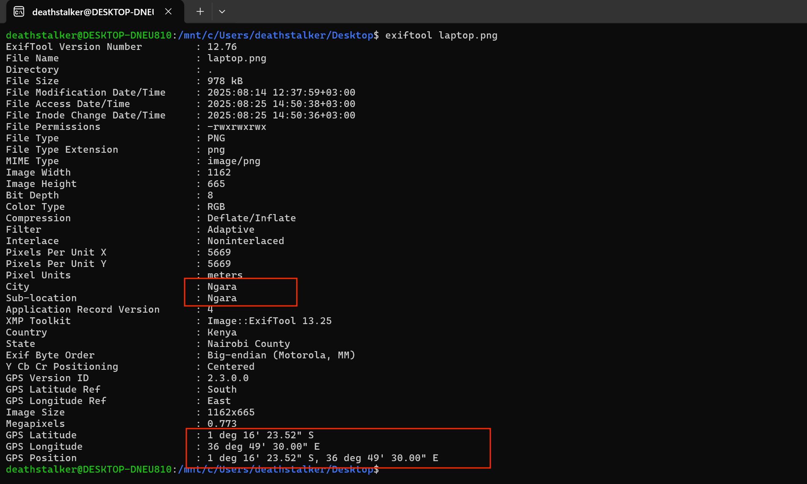

#### Carrier
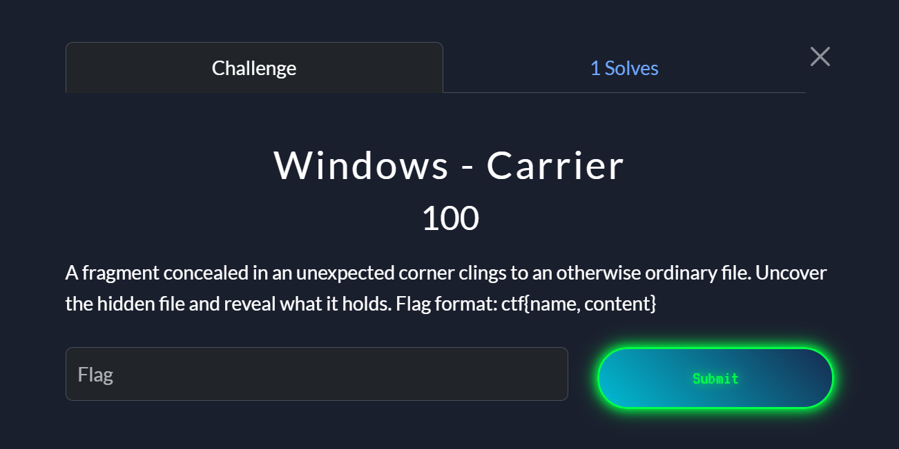
From the challenge name, we are looking at a file concealed inside another file. One of the common ways to do that in windows is through Alternate Data Streams(ADS). 

An Alternate Data Stream is a feature in the NTFS file system that allows a file to contain multiple streams of data. 
- Normally, when you create a file say `flag.txt` it has one main data strema where its file contents are stored. 
- With ADS you can attach hidden streams of data in the same file. 

```powershell
echo "This is hidden data" > flag.txt:hidden.txt
```

`flag.txt` will look like a normal file but now it has a hidden ADS called hidden.txt containing the text "This is hidden data"

After browsing the user files, i was able to identify the below carrier file `scanner.exe` with a hidden data stream.
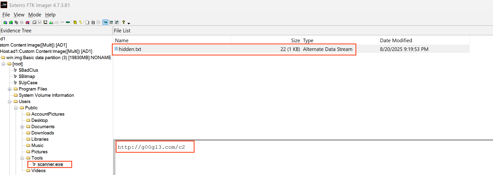

### Misc
#### Archival copy
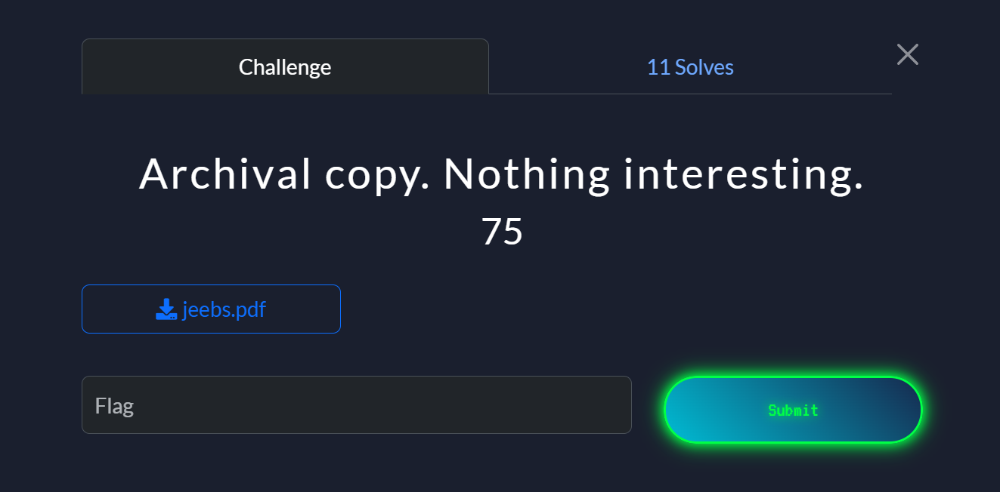

If we examine the strings we can see there is an embeded zip file inside the pdf file.
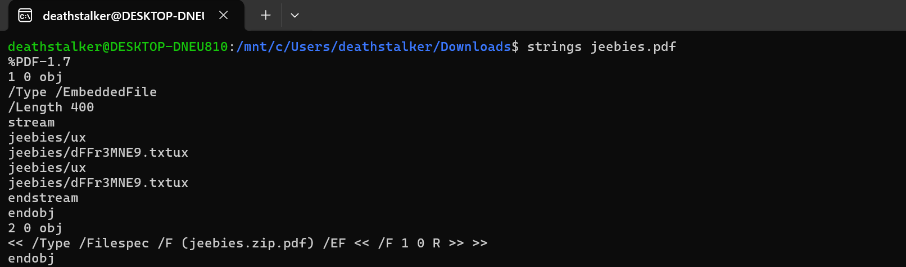

We can use the `zip` command to extract the zip file inside as below.
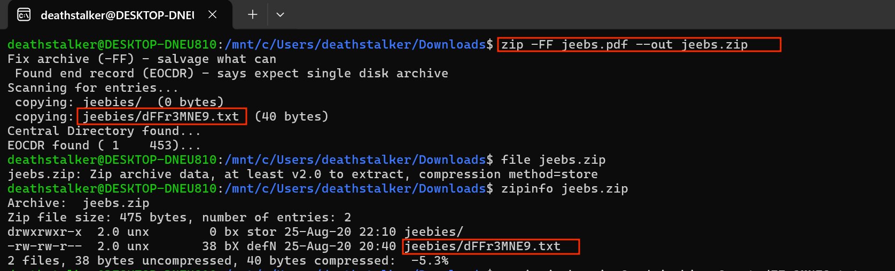

Finaly we can unizp the file and read the contents.
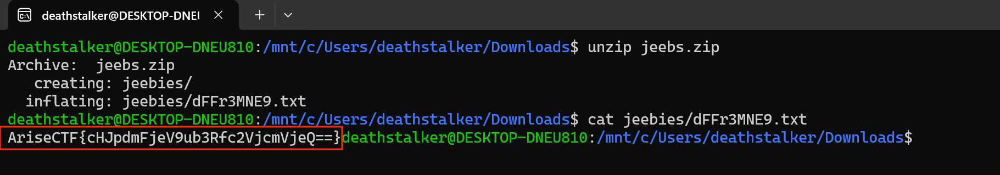