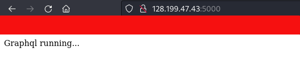
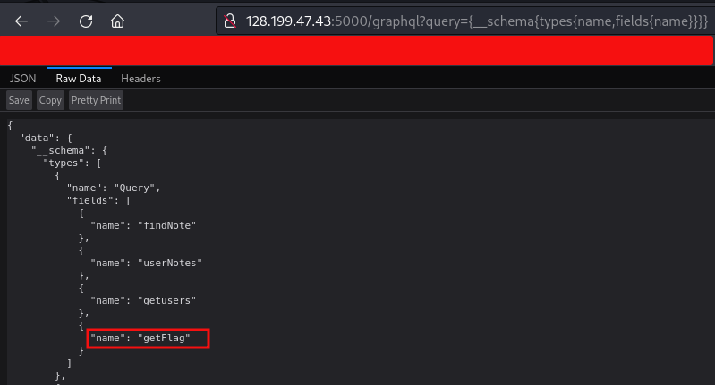
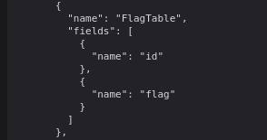
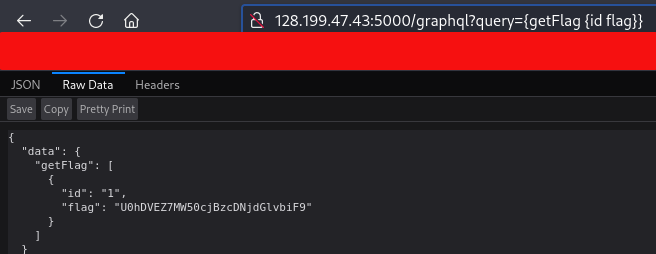
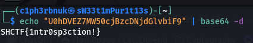
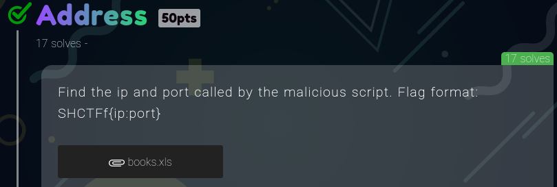
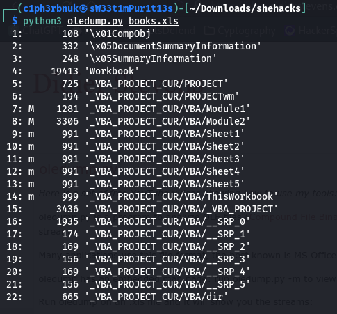
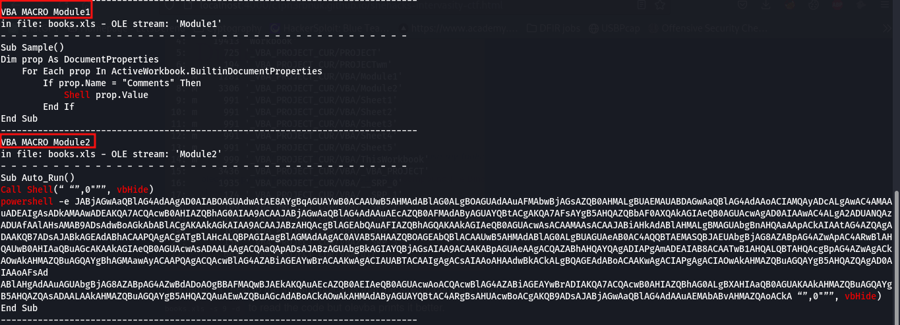
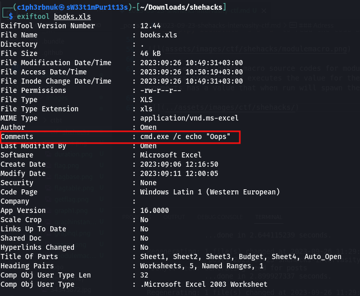
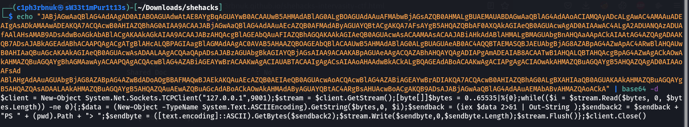

This year i attended the SheHacks Annual InterVasity CTF, a two day event hosted at USIU-Africa. It was a fun experience except the tough CTF challenges :fearful:. This is a write-up of the few i managed to solve. :relieved:

### Graph1
  

The link took us to this page which says `"Graphql running..."`   

   

With basic paths check for the graphql instance i found it runs on `graphql`.  

The next step is to enumerate all available types anf fields with the introspection query `query={__schema{types{name,fields{name}}}}` to discover the schema information.   

With the introspection we uncover `getFlag` field which likely retrieves the contents of the Flagtable.   

Sending `query={getFlag {id flag}}` returns a base64 encoded flag value. 

Decoding... Voila!:open_mouth:

### Adress
* [books.xls](ctf/shehacks/books.xls)   
* [Python Oletools](https://github.com/decalage2/oletools)

This was an easy challenge that required knowledge in analyzing macro-based source code.    
`Macro based malware are scripts(js, powershell,vbs) that are embedded inside Ms office documents to abuse the macro feature.`

To view if there exists any macro emmbeded scripts in a document we use `oledump.py` or `olevba` tools. 

The letter `M` next to the stream indicates that the stream contains Macro emmbeded code. We could use  `oledump.py books.xls -s 8 -d` to read the code but `olevba books.xls` does a better job.

We can see the macro source codes for module 1 ans 2. Module 1 is a Visual Script that checks the document properties and executes the value for the property named comments. If we examine the file properties, comments has a value that spawns the command prompt and output `Oops`.

The second script is a powershell code that executes what seems to be a base64 encoded string. let's uncover what that is. 

It seems to be a basic PowerShell reverse shell that listens for commands from a local server(127.0.0.1) and executes those command. The challege asked for the Ip adress and the port, `SHCTF{127.0.0.1:9001}`:smiley:.