This was an end of year jeopardy style CTF that ran from **12:00pm 31/12/2022** to **9:00pm 01/01/2023** organized by our friends from Tanzania. It was a solo run CTF challenge that each player played alone. I managed position 7 finally. The CTF challenges ranged from Steg(were preety tough), Crypto, Forensics, Web, etc..   
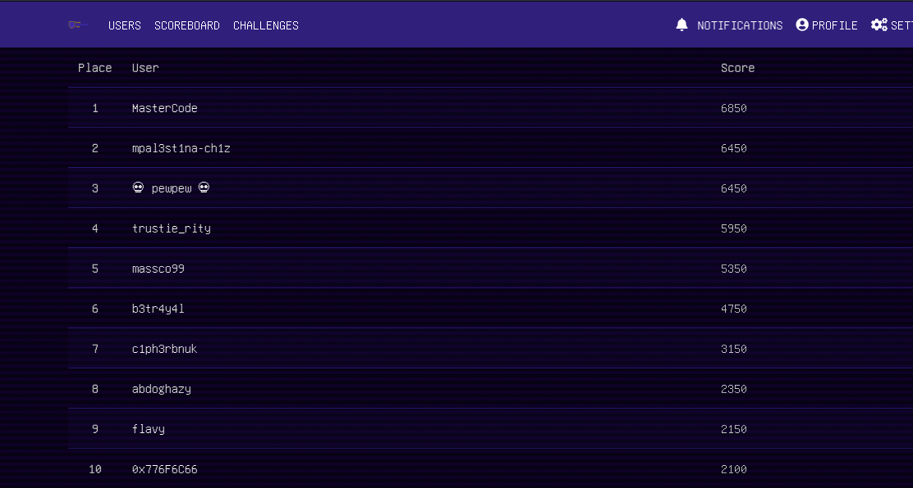   

---
In this post i will be covering step by step solutions to challenges i solved.  

### Cryptography 
#### warm-up  
> use your mental skills to edit some part of the flag you will get after decoding the cipher: `NWHF{p2Ev9fX_M9_vkrIM9Zk3iAR}`'''   

This was a ceasar c1pher. One of my best online tools for decoding and decrypting cryptographic algorithms is [dcode](https://www.dcode.fr/caesar-cipher). It's a pool of cryptographic tool to crack most encodings and encryptions. So, bruteforcing against all possible 26 keys of the ceasar cipher gets us this flag `UDOM{w2Lc9mE_T9_cryPT9Gr3pHY}`.The flag stated we should edit some part of the flag to make sense. Editing the flag to read **"welcome to cryptograpghy"** in 1337 speak, 2 becomes 3, 9 becomes 0, and 3 becomes 4. Therefore the final flag was `UDOM{w3Lc0mE_T0_cryPT0Gr4PHy}`.   
  
#### BABA  
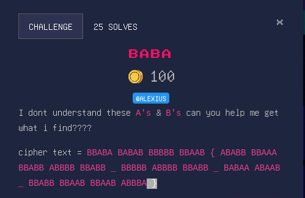  
Our previous tool **dcode** has a tool called [cipher identifier](https://www.dcode.fr/cipher-identifier)(I told you it's a collection of tools) that helps you recognize the type of encryption or encoding that was used to mangle the ciphertext. Slamming our ciphertext it and the first hit tells us that this is a Beacon cipher which is a type of substitution cipher. Again our dcode is a "one size fits all" tool. Using [Beacon cipher](https://www.dcode.fr/bacon-cipher) against our blob we get `FLAGWHEREAREMYEGGS`. Following our flag formats `UDOM{XXX}` we can easily recognize that the flag is `UDOM{WHERE_ARE_MY_EGGS}`.  

#### vigecrack   
> In this challenge we just had the following ciphertext `ZDQQ{i3f3_k3_q0_a1gGr3ffg!!!}`.  

From the challenge name we can assume that this is a vigenere cipher. Vigenere cipher is a type of substitution cipher but it uses different cipher alphabets for encryption. Using this decode [Vigenere decoder](https://www.dcode.fr/vigenere-cipher) and knowing part of our flag is **UDOM** we can use known plaintext attack against it.  
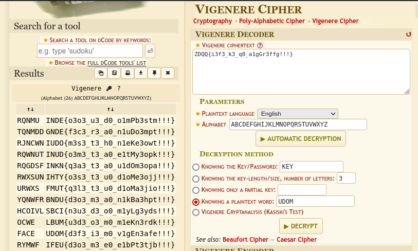  
We get the flag `UDOM{d3f3_i3_m0_v1gEn3afe!!!}`. It wasn't the flag though because it doesn't make sensse yet. I had to get a hint for 200 points :sob: The hint said `social media is the key`. I remembered seeing the word **FACE** besides my flag. Well, dcode is very generous to even include the key that was used used for decryption. I finally figured that the full key was **FACEBOOK**. This time i used the "Knowing the key decryption method" and WALLAH!! there was our final flag `UDOM{h3r3_w3_g0_v1gEn3ers!!!}` :relaxed:  
This challenge reminded me of the quote that says **"It's a skill of great men to make sense out of nonsense"** :smiley:  

### OSINT  
Time to get detective with OSINT challenges.  
#### place 
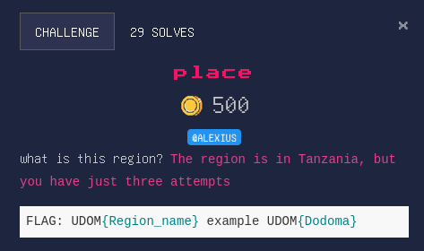   
This was easy peasy. Doing google reverse image search you'll find this link [Kalambo falls](https://www.tripadvisor.com/Attractions-g3532526-Activities-Rukwa_Region.html) from tripadvisor that tells you that the falls is in Rukwa region. Following the flag formart the flag becomes `UDOM{Rukwa}`  

### Forensics  
#### file  
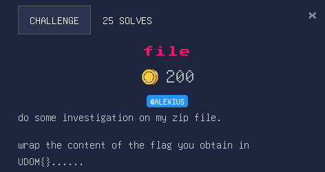  
Attached was a file names **flag.zip**. Running `file flag,zip` identified the file as Zip file. I unzipped the file use `unzip file.pdf` and then determined the file type again with `file flag.pdf`. It is always a good start to identify a file with it's magic byte first. **DON'T TRUST EXTENSIONS**. A magic byte is usually a specific number usually in hexadecimal that is used to identify file type even if the extension is changed. And bang!!! "the pdf was not a pdf", it's actually a WAVE audio file. Wave audio file usualy take the **.wav** extension. Saved it with the right extension and opened it with an audio player software and what do i hear; i hear the famous beeps that identifies it as Morse code. I have this online favourite tool for decoding morsecode [Morse code decoder](https://morsecode.world/international/decoder/audio-decoder-adaptive.html). The text decodes to **M 0 R S 3 S 0 U N D 5 B 3 T T 3 R 1 N M I L 1 T A R 1 3 S**. Wrapping it in our flag format becomes `UDOM{M0RS3S0UND5B3TT3R1NMIL1TAR13S}`   

#### file2  
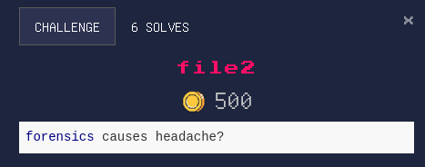   
A zip file was provided containing a folder name **UDOM_people_folder**. The folder had a totaling 9081 files(subfolders and files). All the files were in txt. We had to find the flag. A needle in a haystack right?:fearful: Yeah, forensics causes headache :sweat_smile:. Unix has a tool called grep with helps you print all matches to a pattern. We know the flag starts with **UDOM{**. Let's grep that and hope to find a match. 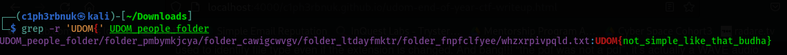 
We found a match but it's not the real flag, it's a bait :unamused:. How did they even know i'll fall for that? Well, time to get creative. the decription says "Forensics causes headaches" . To me it means "It's hard". How about we try to find a match on the word "**hard**". Ooh:open_mouth: There is something spicy at the end ladies and gentlemen.  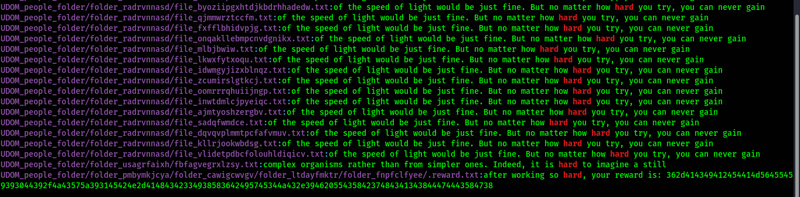   
And that was the flag `UDOM{362d414349412454414d56455459393044392f4a43575a393145424e2d41484342334938583642495745344a432e3946205543584237484341343844474443584738}`  

### Steganography
#### Simple stego
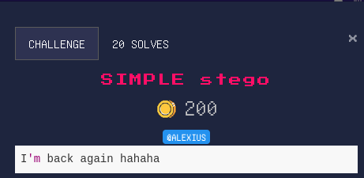 
This was very simple. If you zoom closely you'll notice the flag on the top left conner of the image. `UDOM{BR1LL14NT_5T4RT5_H3R3}`

#### happy new year  
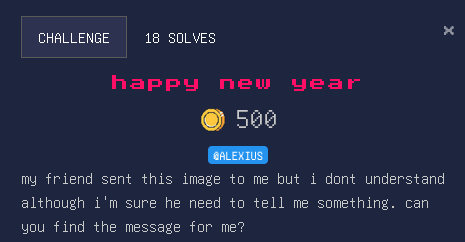  
With this i tried **exiftool, stegsolve,..**** but i didn't find anything. Finally i tried steghide and i found that it requires a password to extract embeded files. **Stegseek** is one of the steganography bruteforce tools that given a wordlist will try cracking the password. 
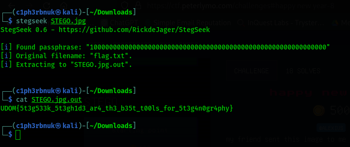.  
Bingo!! We get our flag.  

#### Data 1
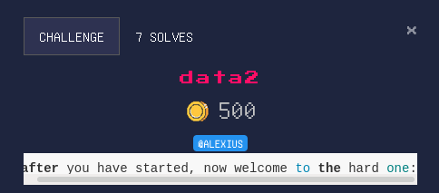  
This challenge was closely related to the **data 1** challenge but i could't decode the last part of the data 1 challenge :disappointed:   
> 50 4b 03 04 14 00 09 00 63 00 85 19 9f 55 00 00 00 00 00 00 00 00 3d 00 00 00 0e 00 2b 00 77 61 79 74 6f 66 6c 61 67 32 2e 74 78 74 55 54 0d 00 07 db ee af 63 db ee af 63 db ee af 63 75 78 0b 00 01 04 e8 03 00 00 04 e8 03 00 00 01 99 07 00 01 00 41 45 03 08 00 6a 74 e9 de 2c f5 76 1a 62 3c 55 06 c0 1c c2 23 ad 52 18 89 f1 97 65 60 fc 48 25 7c cd 24 bc 0a 22 27 d8 62 0e 12 58 ad aa 75 6b 6d 95 e3 e1 3d 54 ee 24 8e 78 e5 af 15 4c c5 5e 1b e9 84 cc cb c0 4e 24 d1 42 3d 23 33 c3 07 03 8d dc e7 19 83 25 2f ff e0 49 4d 58 f0 68 4d c3 50 4b 07 08 cd c5 bf 2a 5b 00 00 00 3d 00 00 00 50 4b 01 02 14 03 14 00 09 00 63 00 85 19 9f 55 cd c5 bf 2a 5b 00 00 00 3d 00 00 00 0e 00 2b 00 00 00 00 00 00 00 00 00 a4 81 00 00 00 00 77 61 79 74 6f 66 6c 61 67 32 2e 74 78 74 55 54 0d 00 07 db ee af 63 db ee af 63 db ee af 63 75 78 0b 00 01 04 e8 03 00 00 04 e8 03 00 00 01 99 07 00 01 00 41 45 03 08 00 50 4b 05 06 00 00 00 00 01 00 01 00 67 00 00 00 c2 00 00 00 00 00  

This clearly looked like a hex dump. The magic byte **50 4b** represents a zip file. You can learn more about magic bytes here [File signatures](https://en.wikipedia.org/wiki/List_of_file_signatures). Linux has a command called **xxd** that can help creating or reversing hex dumps to an original file. Let's first copy the dump to a file names **hexdump.txt** then wit the **-r** option reverse the dump. 
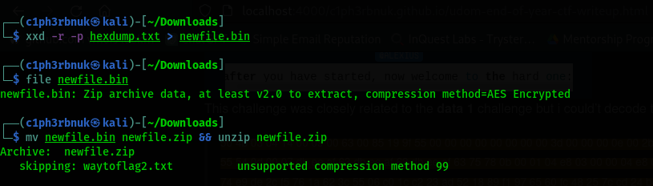  
We se that the file is a password protected zip file(it skips the unziping) containing a file named **waytoflag2.txt**. Some of the famous tool to crack a password protected zip file is a utilitiy called **zip2john** part of the **John the Ripper** tool and **fcackzip**. Let's use zip2john with the famous wordlist **rockyou.txt**
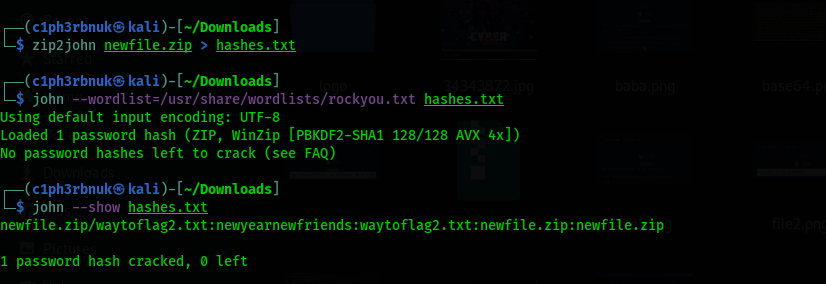  
`newyearnewfriends`
I had already cracked the password. It wil take sometime. the contents of the waytoflag2file.txt were `"RldMTntiMGYnaTNfbTBkX2dzM19uNDVndmlfMHVfeGlia2cwX2hnM3QwfQ=="`. Sure! This looks like base64, let's have some fun!
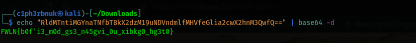  

It's time to ask for help from our friend [cipher identifier](https://www.dcode.fr/cipher-identifier). A if we try the option we finally realize it was Atbash Cipher. And the flag is `UDOM{y0u'r3_n0w_th3_m45ter_0f_crypt0_st3g0}`   

### Web
Lemme put this up-staight before we get to this part. "I'm not well versed in this category". I had to ask ChatGPT some help :joy:  
#### Turaco  
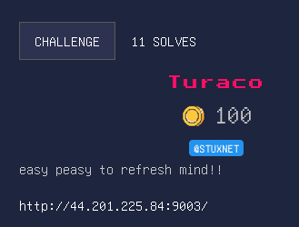  
The website had a password prompt and if you submit anything it returns the following.
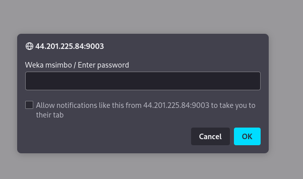  

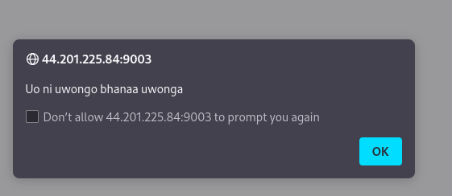  

If we view the source code we see a javascript code.  
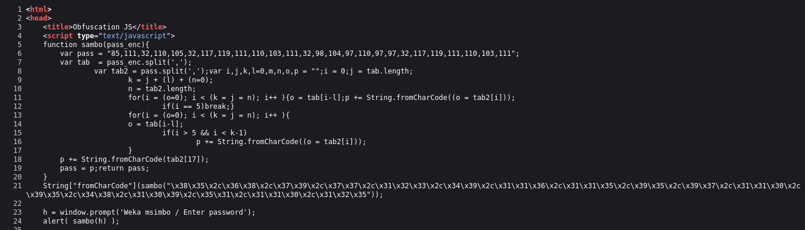  
The function takes a one argument and splits it based on the comma delimiter and strores it in variable `tab`. The function contains variable `pass` which is an array of ascii codes. `tab2` is contains the results of splitting pass on comma. The function then loops through the elements of tab2 and converts each one back to its corresponding character using String.fromCharCode(). It appends each character to the p string. The loop is stopped after the fifth iteration using break. The function then continues to loop through tab2, but this time only adds characters to p if the index of the character in the loop is greater than 5 and less than the length of tab2 minus 1. Finally, the function adds the character at index 17 of tab2 to p and assigns the resulting string to the pass variable, which is returned by the function.   

If you have realized, the function doesn't make use of this part of code `String\["fromCharCode"\](sambo("\x38\x35\x2c\x36\x38\x2c\x37\x39\x2c\x37\x37\x2c\x31\x32\x33\x2c\x34\x39\x2c\x31\x31\x36\x2c\x31\x31\x35\x2c\x39\x35\x2c\x39\x37\x2c\x31\x31\x30\x2c\x39\x35\x2c\x34\x38\x2c\x31\x30\x39\x2c\x35\x31\x2c\x31\x31\x30\x2c\x31\x32\x35"));` The hex character translate to these ascii codes `"85, 68, 79, 77, 123, 49, 116, 115, 95, 97, 110, 95, 48, 109, 51, 110, 125"`. decoding the ASCII back to text we get the flag `UDOM{1ts_an_0m3n}`  

### Two-step-snake
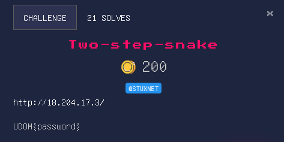  
This challenge had this in it's source code. 
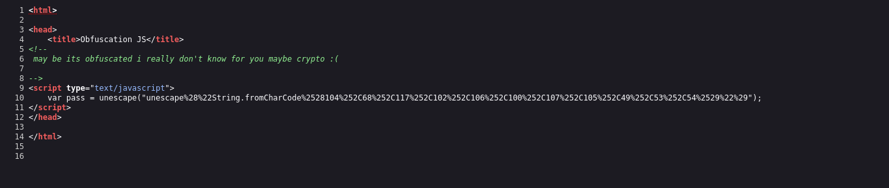 
> The unescape function is a JavaScript function that can be used to decode a string that has been encoded with the escape function. The escape function  URL encodes a string (by replacing certain characters with a percent sign followed by a two-digit hexadecimal code) eg space is encoded as %20.  

The results of the uescape function will be `String.fromCharCode(104,68,117,102,106,100,107,105,49,53,54)`. Deccoding the ASCII code results to the following string `hDufjdki156` which was the password. The flag formart was `UDOM{hDufjdki156}`  

#### wRceb  

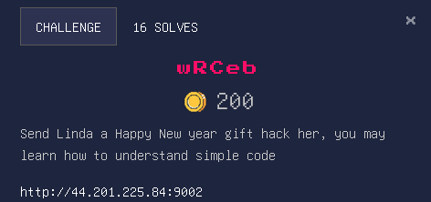  

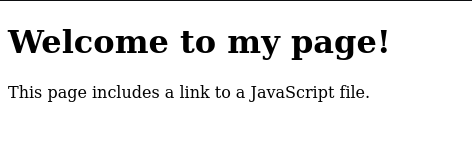

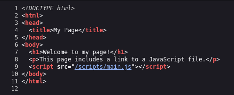

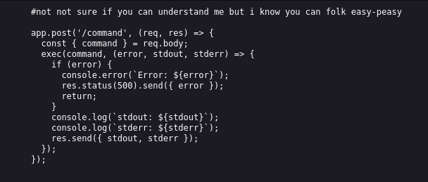  

ChatGPT helped me understand the code.

> This looks like a Node.js route handler for an HTTP POST request that is listening for a /command path. When a request is received, it extracts the command field from the request body, and then passes it to the exec function. The exec function is part of the child_process module in Node.js, and it is used to execute shell commands. It takes a command as an argument and executes it in the system shell.
The exec function has a callback that is called with three arguments: error, stdout, and stderr. error is an error object that is set if there is an error executing the command. stdout and stderr are strings that contain the output of the command written to standard output and standard error, respectively. If there is an error executing the command, the route handler sends an HTTP status code of 500 (Internal Server Error) and an object with the error message as the response. If the command is executed successfully, the route handler sends an object with the stdout and stderr as the response.  

Now we know we need to send a **POST** request to this path **/command** with a JSON request body that includes a **command** field. I have issues with my burpsuite so we are going to use the **CUrL** tool to send the request. We first execute the `ls -la` command which outputs the contents of the current directory. We can see a **flag.txt** file. The `cat flag.txt` outputs the contents of the file.
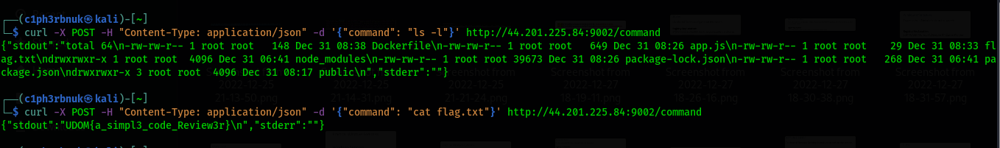 
  
`UDOM{a_simpl3_code_Review3r}`

That's all for the first CTF of the Year buddies!! Hope you enjoyed ! See ya Next time :blush: